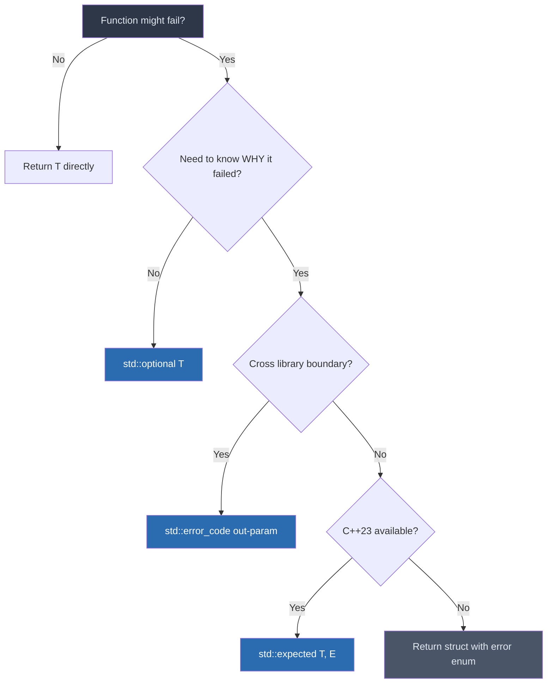

# Robotics & AI C++17 Notes


Welcome to our Modern C++ Course, specifically tailored for Engineers focusing on Robotics.

## Table of Contents

1. [Module 01: Foundations & Compilation](#module-01)
    - [Compilation Pipeline](#module-01-compilation)
    - [First Program Anatomy](#module-01-anatomy)
    - [Build Systems (CMake)](#module-01-cmake)
    - [Understanding Errors](#module-01-errors)
    - [Cementing Foundation: Heartbeat](#module-01-foundation)
2. [Module 02: Variables, Types & Constants](#module-02)
    - [Type Reference](#module-02-types)
    - [Fixed-Width Integers (`<cstdint>`)](#module-02-cstdint)
    - [Robotics Structs](#module-02-struct)
    - [Naming Rules](#module-02-naming)
    - [Scope & Shadowing](#module-02-scope)
    - [Namespaces](#module-02-namespaces)
    - [`auto` Deduction](#module-02-auto)
    - [`const` vs `constexpr`](#module-02-const)
    - [Deep Dive: Const Correctness](#module-02-const-correctness)
    - [`std::string` vs `std::string_view`](#module-02-strings)
    - [Cementing Foundation: Config Manager](#module-02-foundation)
3. [Module 03: I/O & Arithmetic](#module-03)
    - [Performance Checklist: I/O](#module-03-performance)
    - [Deep Dive: `std::chrono` — Timing](#module-03-chrono)
    - [Cementing Foundation: Telemetry Math](#module-03-foundation)
4. [Module 04: Control Flow](#module-04)
    - [Cementing Foundation: State Controller](#module-04-foundation)
5. [Module 05: Loops & Iteration](#module-05)
    - [Storing Data: `std::vector`](#module-05-vectors)
    - [Vector Mechanics: Size vs. Capacity](#module-05-mechanics)
    - [Vector Optimization: `reserve()`](#module-05-reserve)
    - [Fixed-Size Data: `std::array`](#module-05-array)
    - [Deep Dive: STL Algorithms](#module-05-algorithms)
    - [Iterator Invalidation](#module-05-invalidation)
    - [Deep Dive: Real-Time Golden Rule](#module-05-real-time)
    - [Cementing Foundation: Cloud Filter](#module-05-foundation)
6. [Module 06: Structs & Enums](#module-06)
    - [POD Structs](#module-06-pod)
    - [`enum` vs `enum class`](#module-06-enum)
    - [Cementing Foundation: Telemetry Pack/Unpack](#module-06-foundation)
7. [Module 07: Memory & Ownership](#module-07)
    - [Memory Bridge: Interlude](#module-07-interlude)
    - [Pointers vs. References](#module-07-pointers)
    - [Deep Dive: Pointer Const-ness](#module-07-const-pointers)
    - [Manual Memory (`new`/`delete`)](#module-07-manual)
    - [Smart Pointers](#module-07-smart-pointers)
    - [RAII & Ownership](#module-07-raii)
    - [Move Semantics](#module-07-move)
    - [Rule of Zero](#module-07-zero)
    - [The Ownership Decision Tree](#module-07-decision-tree)
    - [Cementing Foundation: Hardware Factory](#module-07-foundation)
8. [Module 08: Functions & Lambdas](#module-08)
    - [Parameter Passing](#module-08-params)
    - [Lambdas & Locality](#module-08-lambdas)
    - [`[[nodiscard]]` Attribute](#module-08-nodiscard)
    - [RVO Optimization](#module-08-rvo)
    - [Lidar Filter Challenge](#module-08-challenge)
    - [Safe Returns (`std::optional`)](#module-08-optional)
    - [`[[maybe_unused]]` Attribute](#module-08-maybe-unused)
    - [Cementing Foundation: Safety Callback](#module-08-foundation)
9. [Module 09: Project Structure & CMake](#module-09)
    - [What is CMake?](#module-09-cmake-intro)
    - [Anatomy of CMakeLists.txt](#module-09-cmakelists)
    - [The Build Workflow](#module-09-workflow)
    - [Unit Testing (`GTest`)](#module-09-gtest)
    - [Cementing Foundation: Architecture](#module-09-foundation)
10. [Module 10: Classes & Encapsulation](#module-10)
    - [State & Behavior](#module-10-members)
    - [Interaction & Safety](#module-10-interaction)
    - [Object Identity (`this`)](#module-10-identity)
    - [Creation & Destruction](#module-10-creation)
    - [Advanced Mechanics](#module-10-advanced)
11. [Module 11: Templates & Polymorphism](#module-11)
    - [Why Templates Exist](#module-11-templates-why)
    - [Good vs Bad Template Usage](#module-11-templates-good-bad)
    - [Polymorphism in Robotics](#module-11-polymorphism)
    - [Template vs Virtual Dispatch](#module-11-template-vs-virtual)
    - [Deep Dive: Fold Expressions](#module-11-fold)
    - [Cementing Foundation: Sensor Pipeline](#module-11-foundation)
12. [Module 12: Concurrency](#module-12)
    - [Why Concurrency Matters](#module-12-why)
    - [Threads](#module-12-threads)
    - [`Mutex` and `lock_guard`](#module-12-mutex)
    - [Multi-Mutex Safety: `std::scoped_lock`](#module-12-scoped-lock)
    - [Readers-Writer Locks: `std::shared_mutex`](#module-12-shared-mutex)
    - [`join` vs `detach`](#module-12-join-detach)
    - [Waiting for Events: `condition_variable`](#module-12-cv)
    - [Asynchronous Tasks: `std::async` & `std::future`](#module-12-async)
    - [Concurrency Pitfalls](#module-12-pitfalls)
    - [Lock-Free Primitives: `std::atomic`](#module-12-atomic)
    - [Cementing Foundation: Telemetry Worker](#module-12-foundation)
13. [Module 13: Production Deployment & Tooling](#module-13)
    - [Static Analysis & Sanitizers](#module-13-sanitizers)
    - [Time-Series Data: Bounded Sliding Window](#module-13-window)
    - [Advanced CMake: `PUBLIC` vs `PRIVATE`](#module-13-cmake-links)
    - [Thread-Safe Logging](#module-13-logging)
    - [Error Reporting: `std::error_code`](#module-13-error-codes)
    - [Static Analysis: `clang-tidy`](#module-13-clang-tidy)
    - [Cementing Foundation: Production Checklist](#module-13-foundation)
14. [Module 14: Advanced Utilities (`variant`, `any`, `tuple`)](#module-14)
    - [`std::variant`: Type-Safe Union](#module-14-variant)
    - [`std::any`: Type-Safe `void*`](#module-14-any)
    - [`std::tuple` & Structured Bindings](#module-14-tuple)
    - [`std::invoke` & `std::function`](#module-14-invoke)
    - [`std::filesystem`](#module-14-filesystem)
15. [Module 15: Performance & Profiling Checklist](#module-15)
    - [Performance Golden Rules](#module-15-rules)
    - [Senior Performance Internals](#module-15-internals)
    - [Profiling Tools & Workflow](#module-15-tools)
16. [Module 16: Capstone — Multi-Threaded Sensor Pipeline](#module-16)
    - [Architecture Overview](#module-16-arch)
    - [Full Implementation](#module-16-impl)
    - [CMakeLists.txt with Sanitizers](#module-16-cmake)
    - [Unit Tests (GTest)](#module-16-gtest)
    - [Profiling Workflow](#module-16-profiling)
17. [Appendix A: Real Robotics Failure Case Studies](#appendix)
18. [Appendix B: Production Design Patterns](#appendix-b)
19. [Appendix C: Testing Discipline](#appendix-c)
20. [Appendix D: ROS 2 Senior Insights](#appendix-d)


---

<a name="module-01"></a>
## Module 01 — What is C++? Compilation & Your First Program
*Phase: Foundations*

C++ is a high-performance, compiled language created by Bjarne Stroustrup. In robotics, it is the industry standard for real-time systems, providing "zero-cost abstractions" that allow for high-level code with maximum hardware efficiency.

> [!NOTE]
> **Design Philosophy**: This module is designed to demystify the "black box" of how code reaches hardware. Robotics involves diverse hardware (ARM/x86); if you don't understand the **Linker vs. Compiler**, you will be paralyzed by the first library error you hit in ROS.

> [!NOTE]
> **Modern C++ (C++17)**: This course focuses specifically on the **C++17 Standard**, which introduced critical robotics features like `std::optional`, `std::string_view`, and structured bindings.

> In the world of Robotics, C++ is the undisputed king. It provides zero-cost abstractions—high-level features that compile into highly efficient machine code. When processing point clouds from a LIDAR at 10Hz or calculating inverse kinematics for a robot arm in under a millisecond, performance is critical.

> **Who Uses This In The Real World?**
>
> *   **Tesla Autopilot** — Real-time sensor fusion and vehicle control systems.
> *   **Open Robotics (ROS)** — ROS 2 core is written in C++ for real-time distributed systems.
> *   **Boston Dynamics** — Control software for Atlas and Spot.
> *   **NVIDIA Isaac** — Accelerated robotics simulation and AI pipelines.

<a name="module-01-compilation"></a>
### How C++ Code Becomes a Robot Action (Compilation Pipeline)

Before we write code, it's crucial to understand how your text becomes a robot action.

| Stage | Action | Intermediate Flag |
| :--- | :--- | :--- |
| **1. Preprocessor** | Resolves `#include` and `#define` (textual copy-paste). | `g++ -E robot.cpp -o robot.i` |
| **2. Compiler** | Translates C++ to Assembly (CPU-specific logic). | `g++ -S robot.cpp -o robot.s` |
| **3. Assembler** | Converts Assembly to Binary Machine Code (Object Files). | `g++ -c robot.cpp -o robot.o` |
| **4. Linker** | Combines `.o` files and libraries into a final executable. | `g++ -o robot_init robot.o` |


---

<a name="module-01-anatomy"></a>
### Your First Robot Program

Let's write a simple program that outputs the status of a robot.

**Code Example**
```cpp
#include <iostream>

int main() {
    std::cout << "[Robot System] Initializing sensors... OK\n";
    std::cout << "[Robot System] Ready for C++17 Robotics!\n";
    return 0;
}
```

#### Anatomy of the Program (Key Terminology)
*   **`#include`**: A **Preprocessor Directive**. Think of it as a command to copy-paste. Before the compiler even sees your code, the preprocessor finds the file `iostream` and pastes its entire contents directly into your script.
*   **`<iostream>`**: The C++ Standard Input/Output Stream library. It contains all the definitions needed for printing text to a screen or reading from a keyboard. (Without this, the compiler won't know what `std::cout` is!).
*   **`int main()`**: The **Entry Point**. When the Operating System (like Linux/Ubuntu running on your robot) executes your program, it blindly searches for a function called `main()` to start running.
    *   The `int` keyword signifies that this function must **return an integer** to the OS when it completes its run.
*   **`std::cout`**: The Standard Character Output. 
    *   `std::` is the **Namespace**. A namespace is like a folder that groups all Standard C++ features together so their names don't clash with variables in your own code (e.g., if you had a custom variable also named `cout`).
    *   `cout` stands for character output (the console terminal).
*   **`<<`**: The **Stream Insertion Operator** (or "Put" operator). It takes the text on its right and "pushes" it into the `cout` stream on its left to be printed.
*   **`return 0;`**: This tells the Operating System that the program finished successfully. Any non-zero value (e.g., `return 1;` or `return -1;`) acts as an exit code signalling that an error or crash occurred.


**Compile and Run (All stages at once):**
```bash
g++ -std=c++17 -Wall -Wextra -o robot_init robot.cpp
./robot_init
```

**Bad Practice — Avoid**
```cpp
// Compiling without warnings — hides critical bugs in your robot's logic
g++ robot.cpp -o robot_init

// using namespace std; — pollutes the global namespace. 
// Can lead to mysterious naming collisions in large ROS projects.
using namespace std;
cout << "Starting motors..."; 

// C-style printf — No type safety (can crash if types don't match)
int battery = 80;
printf("%s", battery); 
```

**Good Practice**
```cpp
#include <iostream>

int main() {
    std::cout << "Starting motors...\n";  // Qualify with std::
    // \n is faster than std::endl (endl forces the OS to "flush the buffer" and draw to the screen immediately, causing massive I/O delays in loops)
    return 0;
}
```

> **Industry Best Practice**
>
> *   **Namespace Safety**: Avoid `using namespace std;` in headers or shared libraries. It pollutes the global namespace and causes naming collisions. In small `.cpp` files or local examples, it is often acceptable for brevity.
> *   **Smart Output**: Avoid `std::endl` inside high-frequency sensor loops (e.g., 200Hz) because it forces a "buffer flush," causing massive I/O delays. Use `\n` instead. **Use `std::endl` intentionally** when you need to ensure a log message is written immediately (like right before a potential crash).
> *   **RAII Beyond Memory**: C++ uses the RAII pattern for more than just memory. For example, `std::lock_guard` (introduced later) automatically unlocks a mutex when the object goes out of scope, preventing deadlocks in multi-threaded robot nodes.
> *   **Strict Warnings**: Always compile with `-std=c++17 -Wall -Wextra -Wconversion -Werror`. 
> *   Use `clang-format` for automatic formatting.
> *   Enable AddressSanitizer from day one: `-fsanitize=address`. It catches memory bugs instantly before they crash your actual robot.

> **Warning**
>
> Every statement ends with `;` — except lines with `{ }`. One missing semicolon can produce 20 error messages. Always fix the FIRST error and recompile.


<a name="module-01-cmake"></a>
### Beyond `g++`: Build Systems (CMake)
While compiling with `g++` works for a single file, real robotics projects (like ROS packages) have hundreds of files. Instead of manually typing long compilation commands, the industry uses **CMake**. 

CMake is a "meta-build system". You write a `CMakeLists.txt` file that describes your project, and CMake automatically generates the complex `Makefile`s for you. 

*A basic `CMakeLists.txt` for our robot program:*
```cmake
cmake_minimum_required(VERSION 3.16)
project(RobotProject)

set(CMAKE_CXX_STANDARD 17)
set(CMAKE_CXX_STANDARD_REQUIRED ON)
add_executable(robot_init robot.cpp)
target_compile_options(robot_init PRIVATE -Wall -Wextra -Wconversion -Werror)
```

<a name="module-01-errors"></a>
### Understanding C++ Errors
C++ compiler errors are notoriously terrifying to beginners, but they follow predictable patterns.

> **The Golden Rule of C++ Debugging**
>
> 1. Scroll to the **VERY TOP** of the error output.
> 2. Fix the *first* error.
> 3. Recompile. 
> 4. (Often, one missing semicolon causes 50 subsequent cascade errors. Do not try to fix error #50!).

**Common Error Types in C++:**
1. **Syntax Error:** `error: expected ';' before 'return'`. You forgot a semicolon or bracket. The compiler doesn't understand your grammar.
2. **Type Error (Semantic):** `error: cannot convert 'std::string' to 'int'`. You tried to do something that violates C++'s strong type system (like passing text to a math function).
3. **Linker Error:** `undefined reference to 'main'`. The *compiler* understood your code, but the *linker* couldn't find the definition for a function you promised existed (often happens if you don't link the right ROS library!).


<a name="module-01-foundation"></a>
### Foundation Cementing: The "ROS-Style" Heartbeat
This example ties together headers, namespacing, and structured terminal output into a "Heartbeat" node—the first thing any professional robot runs.

```cpp
#include <iostream> // Header for output
#include <string>   // Header for text handling

int main() {
    // Qualify with std:: to avoid namespace pollution
    std::cout << "[INFO] [1710456000.123] ControlLoop: Heartbeat pulse detected.\n";
    std::cout << "[WARN] [1710456000.456] PowerManager: Voltage drop in Sector 7.\n";

    // Standard Exit Code
    return 0; 
}
```

---

<a name="module-02"></a>
## Module 02 — Variables, Types & Constants
*Phase: Foundations*

C++ is statically typed—every variable has a type determined at compile time. This ensures that a motor speed isn't accidentally treated as a sensor's serial number.

> [!NOTE]
> **Design Philosophy**: This module prioritizes **Determinism**. Fixed-width integers (`int32_t`) ensure code behaves identically on an Arduino and a Workstation. `constexpr` ensures that math constants (like PI or Gear Ratios) consume ZERO battery or CPU at runtime.

> [!TIP]
> **Modern Tools**: C++17 provides `auto` for type deduction and `constexpr` for zero-cost constants. We will explore these after mastering the basic types.

> **Who Uses This In The Real World?**
>
> *   **Embedded Systems (Bosch, Renesas)**: `int32_t`, `uint8_t` everywhere. You cannot afford to guess size when writing hardware registers or configuring a Motor Controller.
> *   **Robotics Autonomy (Autoware, Apollo)**: `double` for global coordinates (GPS), `float` for local point clouds to save memory bandwidth.
> *   **Game Engines / Simulation (Unreal, Gazebo)**: `constexpr` for compile-time constants like `MAX_ROBOTS` or `PI` — zero runtime overhead.

<a name="module-02-types"></a>
### Type Reference in Robotics

| Type | Use Case | Size |
| :--- | :--- | :--- |
| `bool` | Sensor flags (e.g., `is_obstacle_detected`) | 1 Byte |
| `int` | **Default** for arithmetic, loop counters, and IDs | 4 Bytes |
| `double` | Default for kinematics/coordinates (~15 digits) | 8 Bytes |
| `std::size_t` | Sizes, indices, and memory offsets | 8 Bytes |

<a name="module-02-cstdint"></a>
> [!TIP]
> **Guideline**: Use `int` for general logic and math. Reserve **Fixed-Width Integers** (`int32_t`, `uint8_t`) for hardware protocols, binary formats, or any situation where bit-level precision is mandatory.

> [!IMPORTANT]
> **Avoid Magic Numbers**: Use `std::optional` instead of returning `-1` for sensor failures. This prevents your PID controller from calculating math on an error code!

> **Why use `std::size_t` instead of `int` for sizes?**
> `std::size_t` is guaranteed to be big enough to hold the size of any object in memory. It inherently matches the return type of `sizeof()` and `.size()`. Using `std::size_t` instead of `int` when indexing large LiDAR point clouds avoids critical "signed/unsigned mismatch" compiler warnings and entirely prevents negative-index Out-Of-Bounds memory faults.


<a name="module-02-struct"></a>
### Grouping Data: Your First Robotics Struct
Before we dive into naming rules, it's important to know that you can group these types together into a custom "bag" of data.

```cpp
// A simple struct to represent a Robot's position in 2D space
struct RobotPose {
    double x;      // meters
    double y;      // meters
    double theta;  // orientation in radians
};
```
This is the foundation of almost all robotics messaging (like `geometry_msgs/Pose` in ROS).

<a name="module-02-naming"></a>
### Variable Naming Rules
Identifiers (variable names) in C++ must follow strict rules. If you break them, the code will fail to compile.

1. **Allowed Characters**: Only letters (a-z, A-Z), numbers (0-9), and underscores (`_`).
2. **No spaces or special characters**: `bool is raining;` or `int my-variable = 5;` are **invalid**.
3. **Cannot start with a number**: `int 1st_sensor;` is **invalid**. (But `sensor_1` is fine).
4. **Case-sensitive**: `speed` and `Speed` are completely different variables.
5. **Cannot be a C++ keyword**: You cannot name a variable `int`, `return`, `class`, `auto`, etc.

**Bad Examples (Will not compile)**
```cpp
double max Range = 100.0; // ERROR: Contains a space!
bool $is_active = false;  // ERROR: Contains a special character ($)!
int 1st_scan = 0;         // ERROR: Starts with a number!
int class = 5;            // ERROR: 'class' is a reserved keyword!
```

**Good Examples (Robotics Convention - `snake_case`)**
```cpp
double lidar_max_range = 100.0;
bool is_emergency_stop_active = false;
```


<a name="module-02-scope"></a>
### Deep Dive: Variable Scope & "Shadowing"
In C++, curly braces `{ }` define a **Scope** (a boundary). A variable created inside a scope only exists until the closing brace `}`. 

If you create a new variable with the *exact same name* inside a nested block, it temporarily hides (or **shadows**) the outer variable. This is a common source of bugs for beginners!

```cpp
#include <iostream>

int main() {
    int a = 20; // 'a' is 20 in the outer scope
    
    { // --- A new nested scope begins ---
        int a = 10; // This is a BRAND NEW variable that "shadows" the outer 'a'
        std::cout << a << '\n'; // Prints 10
        
        { // --- Even deeper scope ---
            int a = 5; // Another new variable, shadowing the 10
            std::cout << a << '\n'; // Prints 5
        } // The 'a' that equaled 5 is destroyed here!
        
        std::cout << a << '\n'; // Prints 10 again (the outer 'a' is un-shadowed)
    } // The 'a' that equaled 10 is destroyed here!
    
    std::cout << a << '\n'; // Prints 20 (we are back to the original 'a')
}
```
**Rule of Thumb:** Never intentionally shadow a variable. If you have an outer variable `robot_speed`, don't name a temporary inner variable `robot_speed` as well—the compiler will allow it, but human readers will get confused about which variable is actually being modified.


<a name="module-02-namespaces"></a>
### Deep Dive: Namespaces (Avoiding Name Collisions)
Imagine you are building a massive robot. Your physics team writes a library with an `int max_speed = 100`. Your networking team writes a Wi-Fi library that also happens to have an `int max_speed = 5`. 

If you include both libraries in your `main.cpp`, the compiler will crash, complaining: *"Error: max_speed already defined!"*

**Namespaces** solve this by wrapping code in a unique "folder name".

```cpp
#include <iostream>

// Physics team's code
namespace physics {
    int max_speed = 100;
}

// Networking team's code
namespace network {
    int max_speed = 5;
}

int main() {
    // We use the scope resolution operator '::' to tell the compiler exactly which one we want!
    std::cout << "Robot speed: " << physics::max_speed << '\n';
    std::cout << "Wi-Fi speed: " << network::max_speed << '\n';
    
    return 0;
}
```
This is exactly why we type `std::cout`! The creators of C++ put `cout`, `cin`, and `endl` inside a massive namespace called `std` (standard) so they wouldn't collide with variables you might name `cout` in your own code.

<a name="module-02-auto"></a>
### Deep Dive: `auto`
**Is `auto` a data type or a storage class?** 
In modern C++ (C++11 and later), `auto` is **neither**. It is a *placeholder type specifier*. It simply commands the compiler: *"Look at the value I am assigning, figure out its exact type, and use that type here."* (Note: Prior to C++11, it was a storage class specifier, but that usage is completely obsolete and removed).

**Does using `auto` everywhere affect performance or compile time?**
*   **Runtime Performance:** ZERO impact. `auto x = 5;` compiles to the exact same machine code as `int x = 5;`. 
*   **Compile Time:** The impact is practically negligible. The compiler already knows the type of the right-hand expression; `auto` just tells it to copy that type over to the left side.

**Why use it? (The "Almost Always Auto" paradigm)**
It saves you from typing out massive, unreadable C++ types (which are very common in ROS and PCL), and guarantees that a variable is always initialized.

```cpp
// 1. Simple primitives
auto speed = 5.5;       // deduces double
auto speed_f = 5.5f;    // deduces float (note the 'f' suffix!)
auto is_active = true;  // deduces bool

// 2. Without auto (Hard to read, requires knowing the exact nested type):
pcl::PointCloud<pcl::PointXYZ>::Ptr cloud(new pcl::PointCloud<pcl::PointXYZ>);
std::unordered_map<std::string, double>::const_iterator it = robot_config.begin();

// 3. With auto (Clean, readable, type is deduced perfectly):
auto cloud = pcl::PointCloud<pcl::PointXYZ>::Ptr(new pcl::PointCloud<pcl::PointXYZ>);
auto it = robot_config.begin(); 
```

**When NOT to use `auto`:**
Don't use `auto` if it completely hides the type and makes the code impossible for a human to read without an IDE.
```cpp
// BAD: What does `read_sensor()` return? 
// An int? A double? A custom `SensorData` struct? 
// The reader has no idea without opening the sensor header file!
auto data = lidar.read_sensor();  

// GOOD: The type is explicitly stated, making the code self-documenting.
LidarScan data = lidar.read_sensor(); 

// GOOD: It is perfectly fine to use auto if the right hand side makes it obvious:
auto speed_ms = 5.5;                  // Obviously a double
auto robot = std::make_unique<Bot>(); // Obviously a unique_ptr<Bot>
```

<a name="module-02-const"></a>
### Deep Dive: `const` vs `constexpr` vs `#define`
Immutability is highly valued in safety-critical robotics code. If a variable shouldn't change, explicitly state it. But there are different ways to define constants, and they behave very differently.

#### 1. `#define` (The Preprocessor Macro)
Before the preprocessor even sees your code, it blindly copy-pastes text.
*   **Avoid in Modern C++**: It has no type safety, respects no namespaces, and makes debugging a nightmare.

**The `#define` Macro Trap**:
```cpp
#define SQUARE(x) ((x) * (x))
// NOTE: Even with "correct" parenthesization, macros still have the
// double-evaluation trap. The original `(x) * (x)` (without outer parens)
// ALSO has an operator-precedence bug: `100 / SQUARE(5)` expands to
// `100 / (5) * (5)` = 100, not 4! Outer parens fix precedence but NOT UB:
int result = SQUARE(++x); // DANGEROUS UB: Expands to ((++x) * (++x))
```

#### 2. `const` (The Runtime Lock)
*   **What it means**: "I promise not to change this value after it is initialized."
*   **When to use**: When the value is only known at **runtime** (e.g., read from sensor input), but you want to lock it.
```cpp
int n; std::cin >> n;
const int LOCK = n; // OK!
```
*   **Robotics Value**: Critical for API safety (`const T&`).

#### 3. `constexpr` (The Compile-Time Optimizer)
*   **What it means**: "Evaluate this once during compilation, not while the robot is moving."
*   **When to use**: For universal constants or math operations that never change. 
*   **Performance**: Consumes zero CPU at runtime. The compiler replaces the variable with the pre-computed value.

**`constexpr` Examples**:
```cpp
constexpr double PI = 3.14159;
constexpr int square(int x) { return x * x; }

int main() {
    constexpr int result = square(4); // Pre-computed to 16 at compile time
}
```

**Rule of Thumb:**
1. Default to `constexpr` if the value/logic is universally known before the code runs.
2. Fallback to `const` if the value depends on runtime input but shouldn't change afterward.
3. Ban `#define` for constants or math functions.

<a name="module-02-const-correctness"></a>
### Deep Dive: Const Correctness
In professional robotics, `const` is a tool for **API Stability**. By making variables and parameters `const` by default, you ensure that high-level logic cannot accidentally modify raw sensor data.

```cpp
// Dangerous API: Might modify the LIDAR scan?
void processScan(LidarScan& scan); 

// Professional API: Guaranteed read-only
void processScan(const LidarScan& scan); 
```
**Rule of Thumb**: Start every variable with `const`. Remove it only if you *actually* need to change the value. This prevents an entire class of "State Mutation" bugs.

**Macro vs `constexpr` — The Safety Comparison**:
```cpp
#define SQUARE(x) ((x) * (x))

// constexpr function: Defined at namespace scope (NOT inside another function!)
constexpr int square_fn(int val) { return val * val; }

int main() {
    int x = 5;
    // DANGEROUS: Expands to (++x) * (++x)
    // This is Undefined Behavior (UB)! The value could be 36, 42, or a crash.
    int result = SQUARE(++x); 

    // SAFER: Use constexpr (Predictable evaluation)
    int y = 5;
    int safe_result = square_fn(++y); // result is 36, y is 6.
}
```
**Why it matters in Robotics**: Macro Undefined Behavior is non-deterministic. Your robot might work perfectly during a slow test but execute a "Ghost Command" during a high-speed mission because the compiler optimized a macro substitution differently.

<a name="module-02-strings"></a>
### Strings: `std::string` vs `std::string_view`
In modern C++, **always** use `std::string` for dynamic text and `std::string_view` (C++17) for read-only strings. Never use raw C-style `char` arrays.

**Bad**
```cpp
void logMsg(std::string s); // Unnecessary copy of the entire string
```
**Basic**
```cpp
void logMsg(const std::string& s); // Better, but requires a std::string object
```
**Best Practice**
```cpp
void logMsg(std::string_view s); // Zero-allocation. Works with "Literals" and std::string.
```

> **The Dangling View Trap**: `string_view` does not own data.
> **Critical Hazard**: Never store a `std::string_view` as a class member if it might point to a temporary `std::string`. The temporary will be destroyed, leaving your class member pointing at garbage memory.
> ```cpp
> std::string_view v;
> {
>     std::string s = "Temporary Data";
>     v = s; // v points to s's internal memory
> } // s is destroyed!
> std::cout << v; //  CRASH: v is now a "dangling" pointer to garbage.
> ```

**Bad Practice — Avoid**
```cpp
// Uninitialized variable — undefined behavior
int motor_speed;
std::cout << motor_speed;    // In a robot, this might make the wheel spin uncontrollably!

// Magic numbers — A random number in code with no context or name
if (intensity == 255) { ... } // What does 255 mean here? Max power? An error code? 

// Float for global GPS coordinates — catastrophic rounding
float lat = 40.7128f + 0.0001f;   
if (lat == 40.7129f) enable_brake(); // FALSE! Floating point math is inexact.
```

**Good Practice**
```cpp
#include <cstdint>
#include <string>

// Constants evaluated at compile time with zero runtime cost
constexpr int    MAX_LIDAR_RAYS = 1024;   
constexpr double GRAVITY_MS2    = 9.80665;

int    motor_rpm      = 0;         // always initialize
double distance_to_goal = 0.0;
bool   is_emergency_stop = false;

std::uint8_t  can_bus_register = 0xAA;  // exact width for hardware protocol
std::uint32_t timestamp_ms     = 1000;

auto frame_id = std::string{"base_link"};  
std::size_t cloud_index = 0;               // Unsigned index for iterating arrays
```


> **Industry Best Practice**
>
> *   **Floating Point Math:** Never trust floating point equality operations (`==`). Due to precision errors in IEEE754 floats, `0.1 + 0.2` might not exactly equal `0.3`. Always check if the absolute difference is within a tiny epsilon (e.g., `< 0.0001`).
> *   **Initialization:** As per MISRA C++ (used in Automotive safety standards), every single variable must be initialized before use. Uninitialized local variables are an instant safety violation in production robotics code.
> *   **C-Strings:** Never use C-style strings (`char array[]`) unless forced by hardware SDKs. Always prefer `std::string` or `std::string_view` for modern safety.

<a name="module-02-foundation"></a>
### Foundation Cementing: The Robot Config Manager
Combining `constexpr`, `std::optional`, and `string_view` to build a safe, zero-cost configuration system.

```cpp
#include <iostream>
#include <optional>
#include <string_view>

// 1. Compile-time Configuration (Zero Runtime Cost)
struct BotSpecs {
    static constexpr std::string_view SERIAL = "TITAN-X1";
    static constexpr double CRITICAL_TEMP = 85.0;
};
// NOTE: `constexpr std::string` is NOT valid in C++17 because std::string
// allocates heap memory, which is forbidden in constexpr contexts.
// Use `constexpr std::string_view` for compile-time string constants.
// (C++20 adds constexpr allocator support, making `constexpr std::string` possible.)

// 2. Safe Sensor Handling with optional
std::optional<double> getCPUHeat() {
    bool is_sensor_working = false; // Simulated failure
    if (!is_sensor_working) return std::nullopt;
    return 42.5;
}

int main() {
    // 1. Explicit check
    auto current_heat = getCPUHeat();
    if (current_heat.has_value()) {
        std::cout << BotSpecs::SERIAL << " Temp: " << *current_heat << "C\n";
    } else {
        std::cerr << "[ERROR] Hardware failure on " << BotSpecs::SERIAL << '\n';
    }

    // 2. Elegant fallback using .value_or() (avoids boilerplate if/else)
    // Assume worst-case maximum heat if the hardware sensor fails to respond
    double safe_heat = current_heat.value_or(100.0); 
}
```

---

<a name="module-03"></a>
## Module 03 — Input, Output & Arithmetic
*Phase: Foundations*

> [!NOTE]
> **Design Philosophy**: Robotics is about respecting **Real-Time Deadlines**. This module teaches that even "printing text" (`\n` vs `endl`) can cause a robot to miss a critical sensor loop. Modern math (`clamp`, `hypot`) provides the safe geometry needed for high-speed sensor fusion.

> **Data Logging**: Emitting raw state variables out to a terminal for offline plotting and analysis.

<a name="module-03-performance"></a>
### Robotics Performance Checklist: I/O
1. **Never use `std::endl`**: It forces a "buffer flush" (pausing your program to draw text to the screen immediately), causing massive I/O delays in loops. Always use `\n`.
2. **Qualify with `std::`**: Avoid `using namespace std;` to prevent naming collisions in ROS nodes.
3. **Use `std::cerr` for Errors**: It is unit-buffered (flushes after each complete output operation) and tied to `std::cout`, so errors appear immediately — even during a crash.


**Bad Practice — Avoid**
```cpp
// endl in a tight loop — causes 1,000,000 blocking system calls.
// This introduces jitter that can break real-time sensor fusion.
for (int i = 0; i < 1'000'000; ++i)
    std::cout << points[i].x << std::endl;   

// Not checking cin failure
int target_speed;
std::cin >> target_speed;         // User types "Fast" — cin enters fail state
int new_speed = target_speed * 2; // target_speed is garbage! Math is strictly undefined.

// Silent narrowing — losing precision
double actual_distance = 5.864;
int threshold_dist = actual_distance;  // silently truncates to 5! This could trigger a collision alarm later than expected.

// C-Style Casting — unsafe, hard to search, can silently remove const
double pi = 3.14159;
int pi_int = (int)pi;                  // Avoid! 
```

**Good Practice**
```cpp
#include <iostream>
#include <algorithm> // For std::clamp

// \n in loops, not endl. Massive speed improvement.
for (int i = 0; i < 10; ++i)
    std::cout << "Lidar point " << i << '\n';

// Validate inputs from user consoles before throwing to a control loop
int speed = 0;
if (!(std::cin >> speed)) {
    // Write hardware failures to std::cerr, not cout!
    std::cerr << "[ERROR] Invalid motor speed requested\n"; 
    return 1;
}

// Brace-init prevents narrowing — you'll get a compile error if truncation happens
double dist_to_wall = 1.34;
// int bad_dist{dist_to_wall};   // compile error: narrowing
int safe_dist = static_cast<int>(dist_to_wall);  // static_cast explicitly tells the compiler "I know I am losing decimals, do it."

// Explicit floating-point division for calculating metrics
int encoder_ticks = 4096, gear_ratio = 5;
double motor_revs = static_cast<double>(encoder_ticks) / gear_ratio;

// C++17 std::clamp — Elegant, safe boundary constraints
// Bounds the input strictly between -100 (Reverse Full) and +100 (Forward Full)
int raw_joystick_input = 1500;
int motor_command = std::clamp(raw_joystick_input, -100, 100); // Result: 100

// C++17 std::hypot — Safer 2D Distance
#include <cmath>
double dx = 3.0, dy = 4.0;
double distance = std::hypot(dx, dy); // Result: 5.0 (without overflow risk)
```

> **Industry Best Practice**
>
> *   In production, raw `std::cout` is rarely used inside the core node. You'll use structured logging like `spdlog` or ROS 2's built-in `rclcpp::get_logger()`.
> *   Always write safety-critical errors to `std::cerr` (not `cout`). It is unit-buffered and tied to `std::cout`, meaning errors flush after each output operation and show up instantly, even if the program crashes.

<a name="module-03-chrono"></a>
### Deep Dive: `std::chrono` — Timing in Robotics
Robotics is fundamentally about **time**. Control loops have deadlines, sensor data has timestamps, and motion plans have durations. C++17's `<chrono>` library provides type-safe, zero-overhead time handling.

**Key Concepts**:
| Concept | Description | Example |
| :--- | :--- | :--- |
| **Duration** | A time span with explicit units | `std::chrono::milliseconds(100)` |
| **Time Point** | A specific instant on a clock | `steady_clock::now()` |
| **Clock** | A source of time | `steady_clock`, `system_clock` |

**Choosing the Right Clock**:
| Clock | Monotonic? | Use Case |
| :--- | :---: | :--- |
| `std::chrono::steady_clock` | Yes | **Default for robotics.** Measuring elapsed time, control loop deadlines. Never jumps backward. |
| `std::chrono::system_clock` | No | Wall-clock time for log timestamps. Can jump due to NTP adjustments! |
| `std::chrono::high_resolution_clock` | Varies | Often an alias for `steady_clock`. Use `steady_clock` explicitly. |

> [!WARNING]
> **Never use `system_clock` for measuring elapsed time.** If NTP corrects the system clock mid-measurement, your "10ms" control loop might appear to take -2 seconds. Always use `steady_clock` for durations.

```cpp
#include <chrono>
#include <iostream>
#include <thread>

int main() {
    using namespace std::chrono;

    // 1. Measure elapsed time (Control Loop Profiling)
    auto start = steady_clock::now();
    std::this_thread::sleep_for(milliseconds(10)); // Simulate work
    auto end = steady_clock::now();
    
    // Duration arithmetic — type-safe unit conversion
    auto elapsed_us = duration_cast<microseconds>(end - start).count();
    std::cout << "Loop took: " << elapsed_us << " µs\n";

    // 2. Deadline checking ("Did we miss our 10ms window?")
    constexpr auto DEADLINE = milliseconds(10);
    if ((end - start) > DEADLINE) {
        std::cerr << "[WARN] Control loop overran deadline!\n";
    }

    // 3. C++14 Duration Literals (cleaner syntax)
    auto timeout = 500ms;   // std::chrono::milliseconds(500)
    auto period  = 10us;    // std::chrono::microseconds(10)
    auto delay   = 2s;      // std::chrono::seconds(2)
}
```

> **Industry Best Practice**: Wrap your control loop body with `steady_clock::now()` calls and log the jitter (max - min over N iterations). If standard deviation exceeds 10% of your loop period, investigate allocation or I/O bottlenecks.

<a name="module-03-foundation"></a>
### Foundation Cementing: The Telemetry Math Processor
Tying together `static_cast`, `std::hypot`, and `std::clamp` for processing real sensor telemetry.

```cpp
#include <iostream>
#include <cmath>     // For hypot
#include <algorithm> // For clamp

int main() {
    // 1. Raw Encoder Data (Integers)
    int encoder_ticks_x = 425;
    int encoder_ticks_y = -310;
    
    // 2. Explicit Precision Casting
    double x = static_cast<double>(encoder_ticks_x) * 0.01; // cm to m
    double y = static_cast<double>(encoder_ticks_y) * 0.01;
    
    // 3. High-Performance Distance Calculation
    double dist_from_origin = std::hypot(x, y);
    
    // 4. Safe Boundary Constraint
    double requested_throttle = 150.5;
    double safe_throttle = std::clamp(requested_throttle, 0.0, 100.0);
    
    std::cout << "Distance: " << dist_from_origin << "m | Throttle: " << safe_throttle << "%\n";
}
```

---

<a name="module-04"></a>
## Module 04 — Control Flow — if, else, switch, C++17 if-init
*Phase: Foundations*

> [!NOTE]
> **Design Philosophy**: Decision-making in robotics must be airtight. This module focuses on **Robust Logic**. `if-init` prevents "Stale Data" bugs where old sensor readings leak into new decisions, and `switch` enums lay the groundwork for reliable high-speed State Machines.

> **Theory**
>
> C++ control flow: `if/else if/else`, `switch`, and ternary `?:`.
> *   **C++17 if-init**: `if (auto x = getValue(); x > 0) { }`. Limits variable scope strictly to the `if` block, preventing stale data bugs.
> *   **C++17 `if constexpr`**: A "Performance Optimizer." It evaluates the condition at **compile time**. If false, the compiler completely discards the branch. It will not even check if the code inside the discarded branch is valid for the current type! This is essential for writing generic templates that need different logic for different sensor types, ensuring zero runtime overhead.
>
>     ```cpp
>     template<typename Sensor>
>     void init(Sensor s) {
>         if constexpr (std::is_same_v<Sensor, Lidar>) {
>             s.spinUpMotor(); // Only compiled if s is a Lidar
>         } else {
>             s.powerOnCamera(); // Discarded for Lidars
>         }
>     }
>     ```
> *   **Short-circuiting**: In `A && B`, `B` isn't checked if `A` is false.

> **Who Uses This In The Real World?**
>
> *   **Robotic State Machines (SMACH, Behavior Trees)**: Huge `switch` blocks on enum game states — `IDLE`, `NAVIGATING`, `OBSTACLE_AVOIDANCE`, `ERROR`.
> *   **Network Packet Parsers (DDS, FastRTPS)**: Switch on protocol type byte to decode incoming commands to the robot.
> *   **Embedded Firmware (Arduino, Zephyr RTOS)**: Every raw sensor read and interrupt handler is an `if/switch` statement.

**Bad Practice — Avoid**
```cpp
// Implicit bool conversion — what does 'sensor_reading' mean?
int sensor_reading = read_lidar();
if (sensor_reading) { ... } // Unsafe! Is it a distance? A status code?

// = instead of == — assignment in condition, always true
if (motor_status = 1) { 
    std::cout << "Stopping!\n"; // ALWAYS runs because 1 is true
}

//  Switch without break — silent fallthrough bug
int robot_state = 0; // 0=IDLE, 1=MOVING
switch (robot_state) {
    case 0: std::cout << "Checking battery...\n"; // Falls through!
    case 1: std::cout << "Driving forward!\n"; break;
}

//  Variable leaks outside its valid scope
int lidar_status = read_lidar_status(); 
if (lidar_status != 0) {
    std::cout << "Lidar OK\n";
}
// lidar_status is STILL in memory here! A programmer might accidentally use it 50 lines later when it's stale data.

//  Deep nesting — "arrow code"
bool power = true, battery = true, motors = true;
if (power) { if (battery) { if (motors) { std::cout << "Drive!\n"; } } }
```

**Good Practice**
```cpp
#include <iostream>

// Use enum class — scoped enums prevent name collisions (see Module 06)
enum class RobotMode { IDLE, MOVING, FAULT };

// Explicit Boolean Checks — Mathematically clear and safe
if (int battery_pct = get_battery(); battery_pct < 20) {
    std::cerr << "Low Battery!\n";
}

// State Machine with [[fallthrough]]
enum class JointState { INIT, CALIBRATING, READY, FAULT };
JointState current_state = JointState::INIT;

switch (current_state) {
    case JointState::INIT: 
        setup_hardware(); 
        [[fallthrough]]; // C++17 attribute for intentional fall-through
    case JointState::CALIBRATING: 
        run_calibration(); break;
    case JointState::READY: 
        drive(); break;
    case JointState::FAULT: 
    default: 
        emergency_stop(); break;
}

//  Use Logical AND (&&) to avoid deep nesting
bool power = true, battery = true, motors = true;
if (power && battery && motors) {
    std::cout << "Drive!\n";    // Clear, linear execution flow
}
```

> **Industry Best Practice**
>
> *   **Guard Clauses / Logical Combinations** (like using `&&`) are the standard in high-performance robotics code to reduce deep nesting, making the "happy path" readable. (We will cover "Early Returns" inside functions later).
> *   **Explicit Boolean Checks**: `clang-tidy` (a popular industry tool that scans C++ code for unsafe mistakes) has a strict robotics rule called `readability-implicit-bool-conversion`. In C++, any integer that is not `0` is technically considered `true`. 
>     *   **Confusing/Unsafe**: `if (sensor_value) { ... }` — Does this mean the sensor is ON? Or does it mean it read a distance of 5 meters?
>     *   **Safe/Explicit**: `if (sensor_value != 0) { ... }` — Now it is mathematically clear we are checking that the value is non-zero, not checking a true/false flag.

<a name="module-04-foundation"></a>
### Foundation Cementing: The Intelligent State Controller
Combining enums, `if-init`, and `switch` with `[[fallthrough]]` to build a clean robot safety handler.

```cpp
#include <iostream>

enum class SystemState { BOOTING, ACTIVE, EMERGENCY_STOP, MAINTENANCE };

int main() {
    SystemState current_state = SystemState::ACTIVE;
    int battery_level = 15;

    // 1. C++17 if-init: 'is_low' exists only inside this if/else block
    if (bool is_low = (battery_level < 20); is_low) {
        current_state = SystemState::MAINTENANCE;
    }

    // 2. Clean State Switching
    switch (current_state) {
        case SystemState::BOOTING:
            std::cout << "System is warming up...\n";
            [[fallthrough]]; 
        case SystemState::ACTIVE:
            std::cout << "Mission in progress. Battery: " << battery_level << "%\n";
            break;
        case SystemState::EMERGENCY_STOP:
            std::cerr << "HALT: Mechanical failure detected!\n";
            break;
        case SystemState::MAINTENANCE:
            std::cout << "Heading to charging dock.\n";
            break;
    }
}
```

---

<a name="module-05"></a>
## Module 05 — Loops — for, range-for, while, do-while
*Phase: Foundations*

> [!NOTE]
> **Design Philosophy**: A LIDAR generates 100k+ points a second, so this module is about **processing massive data streams**. `vector::reserve()` and `std::array` teach that how you store data is as important as how you loop, helping you avoid latency jitter in control loops.

> **Theory**
>
> Efficiently processing large data streams (like Lidar point clouds) requires choosing the right container:
> 
> ### Standard Library (STL) Containers
> | Container | Structure | Use Case in Robotics |
> | :--- | :--- | :--- |
> | `std::vector` | Dynamic Array | **Default Choice**. Sensor scans, obstacle lists. |
> | `std::array` | Fixed Array | IMU Covariance, 3D Coordinates (Zero-overhead). |
> | `std::map` | Balanced Tree | Parameter lookups (Ordered). |
> | `std::unordered_map`| Hash Table | Fast lookups for semantic map IDs. |
>
> Efficiently processing large data streams (like Lidar point clouds) requires choosing the right loop:
> *   **Range-based for**: `for (const auto& element : container)`. The **Industry Standard**. Use `const auto&` to avoid expensive copies of large objects.
> *   **C++17 Structured Bindings**: `for (auto& [key, val] : map)`. Unpack pairs instantly without using `.first` or `.second`.
> *   **Iterator Invalidation**: Never add or remove elements from a container while looping over it.

<a name="module-05-vectors"></a>
### Storing Data: `std::vector` (The Dynamic Array)
The most common way to store multiple items in C++ is `std::vector`. Unlike a normal array, it can grow as you add more data—perfect for lidar scans where the number of reflected points changes every second.

**1. Adding Elements**
```cpp
std::vector<int> sensor_ids;

// push_back: Adds to the end
sensor_ids.push_back(101); 

// emplace_back: More efficient (constructs in-place)
sensor_ids.emplace_back(102); 
```

**2. Removing Elements**
```cpp
// pop_back: Removes the VERY LAST element
sensor_ids.pop_back(); 

// erase: Removes at a specific position (using an iterator)
sensor_ids.erase(sensor_ids.begin()); // Removes the first element

// clear: Removes EVERYTHING (Size becomes 0)
sensor_ids.clear();
```

<a name="module-05-mechanics"></a>
### Vector Mechanics: Size vs. Capacity
This is the most misunderstood part of C++. To stay fast, a vector doesn't just allocate space for what you have; it allocates a "Buffer" for what you *might* add.

| Term | Definition | Context |
| :--- | :--- | :--- |
| **Size** | How many elements are *actually* in the vector. | `vec.size()` |
| **Capacity**| How many elements the vector *can hold* before it must reallocate. | `vec.capacity()` |

**The Growth Lifecycle ($O(N)$ Reallocation Cost):**
1.  You `push_back` an element.
2.  If `size == capacity`, the vector is "Full."
3.  The vector **pauses your robot code** (unless mitigated by RTOS deterministic allocators like `TLSF`), asks the OS for a bigger spot in memory (usually 1.5x or 2x larger), copies/moves all $N$ existing elements there, and deletes the old memory.
4.  **This is the "Resize Jitter"**: An $O(N)$ hidden cost that causes non-deterministic latency spikes in high-frequency control loops.

**Vector vs. Array: Sizing at a Glance**
| Feature | `std::array<T, N>` | `std::vector<T>` |
| :--- | :--- | :--- |
| **Sizing** | **Static**: Fixed at compile time. | **Dynamic**: Can grow/shrink. |
| **Storage** | Stack (usually). | Heap (always). |
| **Overhead** | ZERO. Exactly N elements. | Variable (usually has extra capacity). |
| **Robotics Use** | IMU data, PID gains, 3D Pose. | Lidar clouds, Path waypoints. |

<a name="module-05-reserve"></a>
### Senior-Level Optimization: `reserve()`
If you don't tell a vector how much memory you need, it will "guess". Every time it guesses wrong, it stops your robot code, allocates new memory, and copies all data. This creates **non-deterministic latency**.

```cpp
std::vector<double> scan;
scan.reserve(1080); // Allocate space for 1080 Lidar points ONCE.
```

<a name="module-05-array"></a>
### Fixed-Size Data: `std::array`
For data that *never* changes size (like a 3D Coordinate), use `std::array`. Its elements are stored **inline** within the object itself. 
*   If the `std::array` is a local variable, it lives on the **Stack**.
*   If it's inside a `std::vector` or a `heap-allocated class`, it lives on the **Heap**.

```cpp
#include <array>
std::array<double, 3> position = {1.0, 2.5, 0.0}; // Guaranteed 3 elements.
```

<a name="module-05-cache"></a>
### Deep Dive: Cache Locality (The Silicon Reality)
In robotics, accessing data sequentially from a contiguous block of memory (`std::vector`, `std::array`) is orders of magnitude faster than accessing scattered memory (`std::list`, `std::map`, heavily nested pointers).

**CPU Reality (Must Know)**u
| Level | Speed |
| :--- | :--- |
| **L1 Cache** | ~1 ns |
| **L2 Cache** | ~4 ns |
| **RAM** | ~100 ns |

**Key Rule**: *Memory access dominates performance—not computation.*

**Good vs Bad Practices**
```cpp
// BAD: pointer chasing (cache miss heavy)
std::list<int> waypoints;

// GOOD: contiguous memory
std::vector<int> waypoints;
```

**Robotics Impact:** Critical for point cloud processing, SLAM maps, and high-frequency sensor buffers where L1 cache hits are mandatory.

<a name="module-05-allocators"></a>
### Deep Dive: Allocators & Real-Time Safety
The default allocator in C++ (`std::allocator`) uses standard heap allocation (`new`/`delete`), which is non-deterministic (meaning you cannot guarantee how many milliseconds it will take). This can cause jitter in real-time control loops.

**Robotics Rule**: *Deterministic memory > convenient memory.*

**Solution Direction:**
1.  **Preallocate memory**: Use `.reserve()` up front.
2.  **Use custom allocators**: Write your own deterministic allocators.
3.  **Advanced C++17**: Use `std::pmr` (Polymorphic Memory Resources) for stack-based or pre-allocated buffers.

**Example: `std::pmr::monotonic_buffer_resource`**
```cpp
#include <memory_resource>
#include <vector>

void process_1000hz_control_loop() {
    // 1. Allocate a fixed memory buffer directly on the stack 
    std::array<std::byte, 1024> buffer; 
    
    // 2. Create a fast, lock-free memory resource mapped strictly to this buffer
    std::pmr::monotonic_buffer_resource memory_resource(buffer.data(), buffer.size());

    // 3. This vector will NEVER hit the OS heap (unless it exceeds 1024 bytes).
    // It safely reuses the deterministic stack buffer. Real-time guaranteed.
    std::pmr::vector<int> real_time_points{&memory_resource};
}
```

<a name="module-05-algorithms"></a>
### STL Algorithms: Stop Writing Raw Loops
Modern C++ advocates for "No Raw Loops." Algorithms in `<algorithm>` are safer, often faster, and easier to read.

```cpp
#include <algorithm>
#include <vector>

std::vector<int> scores = {90, 45, 80};

// 1. Sort sensor data
std::sort(scores.begin(), scores.end());

// 2. Optional: Parallel execution (C++17) - Utilize all CPU cores automatically!
// #include <execution>
// std::transform(std::execution::par, scores.begin(), scores.end(), scores.begin(), [](int s){ return s + 5; });
std::transform(scores.begin(), scores.end(), scores.begin(), [](int s){ return s + 5; });

// 3. Filter data (The erase-remove idiom)
scores.erase(std::remove_if(scores.begin(), scores.end(), [](int s){ return s < 50; }), scores.end());
```

<a name="module-05-invalidation"></a>
### Deep Dive: Iterator Invalidation
Inside a `for` or range-based `for` loop, C++ uses hidden pointers called **iterators**. 

**The Rule**: Avoid modifying a container (adding/removing) while using a range-based `for` loop. If you must modify, use an explicit iterator and update it (like `it = vec.erase(it)`), or use the **erase-remove** idiom shown above.

**Bad Practice — Avoid**
```cpp
//  Signed/unsigned comparison — logic bug with warning
std::vector<int> v = {1,2,3};
for (int i = 0; i < v.size(); ++i)  // v.size() is size_t (unsigned)
    std::cout << v[i];

//  Copying large objects in range-for — AVOID plain 'auto' for non-trivial types
for (auto name : bigVector)          // copies every element — BAD for large types
    process(name);

// BEST PRACTICE for range-for: Default to const auto& to avoid copies
// Only use 'auto&' when you need to mutate, and plain 'auto' for cheap copies (int, bool)
for (const auto& name : bigVector)   // zero-copy, read-only — preferred default
    process(name);

//  Modifying container while iterating — undefined behavior
for (auto it = vec.begin(); it != vec.end(); ++it)
    if (*it == 42) vec.push_back(99);  // push_back may reallocate memory. Range-for iterators will be invalid! (Iterator Invalidation)

//  Off-by-one
for (int i = 0; i <= v.size(); ++i)  // should be <, not <=
    std::cout << v[i];               // v[v.size()] is UB
```

**Good Practice**
```cpp
#include <iostream>
#include <vector>
#include <string>
#include <map>

std::vector<std::string> names = {"Alice", "Bob", "Carol"};

//  const auto& — no copy, cannot accidentally modify
for (const auto& name : names) {
    std::cout << name << '\n';
}

//  auto& — modify elements in-place
for (auto& name : names) {
    name += "_processed";
}

//  Index loop — use size_t
for (std::size_t i = 0; i < names.size(); ++i) {
    std::cout << i << ": " << names[i] << '\n';
}

//  C++17 structured binding in range-for
std::map<std::string, int> scores = {{"Alice", 95}, {"Bob", 88}};
for (const auto& [name, score] : scores) {
    std::cout << name << ": " << score << '\n';
}

//  Safe hardware parsing loop with break/continue
while (true) {
    auto message = read_sensor_data();
    if (message.empty()) continue; // Skip bad reading
    if (message == "STOP") break;  // Exit loop safely
    process(message);
}

//  do-while — ideal for hardware polling or user validation
// Guarantees the code inside the loop runs AT LEAST ONCE before checking the condition.
int motor_speed;
do {
    std::cout << "Enter motor speed (0-100): ";
    std::cin >> motor_speed;
} while (motor_speed < 0 || motor_speed > 100);
```

> **Industry Best Practice**
>
> Prefer range-based for over index-based whenever you don't need the index — cleaner intent, less error-prone.
> Google style: pre-increment (++i) not post-increment (i++) for loop variables. Post creates unnecessary copy for non-trivial types.
> To filter+erase from a vector: use erase-remove idiom (std::remove_if + erase). Never erase inside range-for.

<a name="module-05-real-time"></a>
### Deep Dive: The Real-Time Golden Rule

In robotics, the high-frequency control loop (the loop reading IMU and sending velocity commands) has a strict deadline (e.g., 100Hz = 10ms). 

**The Golden Rule**: *Never allocate memory inside a real-time control loop.* 

Memory allocation (calling `new`, `std::string`, or using `vector::push_back` without `reserve`) involves OS system calls. The OS might take 100 microseconds, or it might decide to defragment memory and take 50 milliseconds. This causes **jitter**, making your control loop miss its deadline and causing your robot to jerk or crash.

Always pre-allocate buffers (like `scan.reserve(1080)`) before the loop starts!

<a name="module-05-foundation"></a>
### Foundation Cementing: The Cloud Filter Loop
Using range-based `for` with `const auto&` to process sensor data efficiently and safely.

```cpp
#include <iostream>
#include <vector>

int main() {
    // 1. A simulated Lidar point cloud (Distances in meters)
    std::vector<double> scan = {1.2, 0.5, 15.0, 0.1, 4.2};
    std::vector<double> filtered_scan;
    
    // 2. Optimization: Pre-allocate memory
    filtered_scan.reserve(scan.size());

    // 3. Clean Range-for with read-only constraint
    for (const auto& distance : scan) {
        if (distance > 0.2) { // Minimum safety standoff
            filtered_scan.push_back(distance);
        }
    }

    std::cout << "Filtered " << (scan.size() - filtered_scan.size()) << " noise points.\n";
}
```

---

<a name="module-06"></a>
## Module 06 — Structs & Enums
*Phase: Core C++*

> [!NOTE]
> **Design Philosophy**: This module shifts the focus from variables to **messages**. Structs define the robot's internal language. `enum class` ensures that robot states do not get mixed up with pin numbers, preventing catastrophic logic collisions at runtime.

> **Theory**
>
> **Struct vs Class:** In C++, they are structurally identical except `struct` members default to `public` access, whereas `class` members default to `private`.
> *   **Rule of Thumb:** Use a `struct` for "Plain Old Data" (POD) where everything is public and there are no strict rules (e.g., `struct Point3D { double x, y, z; };`). 

<a name="module-06-pod"></a>
### Deep Dive: Plain Old Data (POD) Structs
We mentioned earlier that you should use `struct` for "Plain Old Data". What exactly does that mean?

In robotics, we constantly pass chunks of raw data around (e.g., reading exactly 12 bytes from a serial port representing X, Y, Z coordinates). A POD Struct is simply a struct that has:
1.  **No custom constructors or destructors.**
2.  **No `private` or `protected` members.**
3.  **No virtual functions.**

```cpp
// A perfect POD Struct
struct Point3D {
    float x;
    float y;
    float z;
};

int main() {
    Point3D location = {10.5f, -2.0f, 0.0f}; 
    
    // C++17 Structured Bindings: Unpack instantly!
    auto [x_val, y_val, z_val] = location;
    std::cout << "Robot is at " << x_val << ", " << y_val << '\n';
}
```
If you ever find yourself adding `private` variables or complex constructors to a struct, you should immediately change the word `struct` to `class` to signal to other developers that this object has complex internal logic!

<a name="module-06-enum"></a>
### Deep Dive: `enum` vs `enum class`
When programming a robot, you often have variables that can only be one of a few states (e.g., `IDLE`, `MOVING`, `ERROR`). Beginners often use integers for this: `int state = 1;`. But what does `1` mean? This is called a "Magic Number" and is a terrible practice.

To fix this, C++ has **Enums** (enumerations), which map words to integers hidden from the programmer.

```cpp
// Bad Practice: Old C-style Enums
enum RobotState { IDLE, MOVING, ERROR };
// Problem: These words leak into the global scope. If another library also defines 'enum NetworkState { ERROR, CONNECTED };', your code will fail to compile because 'ERROR' is defined twice!

// Good Practice: C++11 enum class (Scoped Enums)
enum class RobotState { IDLE, MOVING, ERROR };
enum class NetworkState { DISCONNECTED, CONNECTED, ERROR };

int main() {
    // We MUST specify the scope using '::'
    RobotState current_state = RobotState::MOVING;
    NetworkState wifi_state = NetworkState::ERROR; // No collision!
    
    // Scoped enums also prevent accidental math operations
    // if (current_state == 1) { ... } // Compiler error! Cannot compare enum class to an int!
}
```
> **Rule of Thumb:** Never use a regular `enum`. Always type `enum class` to protect your state names from colliding with other robotics packages.

<a name="module-06-foundation"></a>
### Foundation Cementing: The Telemetry Pack/Unpack
Combining POD Structs and C++17 Structured Bindings to handle IMU data packets.

```cpp
#include <iostream>
#include <chrono>

// 1. POD Struct: Zero-overhead data bag
struct IMUPacket {
    double accel_x, accel_y, accel_z;
    std::chrono::steady_clock::time_point timestamp;
};

int main() {
    // 2. Aggregate Initialization
    auto now = std::chrono::steady_clock::now();
    IMUPacket data = {0.05, -9.81, 0.02, now};

    // 3. C++17 Structured Bindings: Immediate unpacking
    auto [ax, ay, az, time] = data;

    // Convert time to nanoseconds safely
    auto time_ns = std::chrono::duration_cast<std::chrono::nanoseconds>(time.time_since_epoch()).count();
    std::cout << "Gravity Vector Y: " << ay << " m/s^2 at T=" << time_ns << "ns\n";
}
```

---

<a name="module-07-interlude"></a>
### The Physical Memory Bridge: From Structs to Pointers
*A Pedagogical Interlude*

Before we dive into Memory, let's understand **why** we need it. 

Imagine a `RobotPose` struct. It's like a **House**. 
- When you pass it to a function "By Value", you are **building a perfect replica of that house** in a new location. It's expensive and slow.
- When you pass it "By Reference" or "By Pointer", you are simply sending the **GPS Coordinates (Address)**. The function doesn't need to rebuild the house; it just knows where to look.

**Module 07** teaches you how to manage these "Addresses" safely.

---

<a name="module-07"></a>
## Module 07 — Memory: Stack, Heap, and Ownership
*Phase: Core Systems Engineering*

> [!NOTE]
> **Design Philosophy**: This module is built to eliminate the silent killers of robotics: memory leaks and segmentation faults. In a long mission, even a tiny leak will eventually crash the robot. Smart pointers make safety a structural guarantee rather than a manual chore.

### Concept
Memory management is the art of balancing performance and safety. In C++, we have two primary storage areas: the **Stack** and the **Heap**. Understanding their lifecycle is the difference between a high-performance control loop and a system that crashes randomly.

### Why This Exists
Robotics systems must be deterministic. If your robot's path planner pauses for 200ms because of a "Garbage Collection" cycle, the robot might hit an obstacle. C++ gives you direct control over memory, allowing for zero-cost abstractions and predictable performance.

#### Stack vs Heap: A Physical Analogy
```text
STACK (Automatic + Fast)         HEAP (Dynamic + Slower)
+------------------------+      +------------------------+
| [ LIFO Structure ]     |      | [ Unordered Pool ]     |
| Pre-allocated at boot  |      | Allocated via OS req   |
| Scope-based cleanup    |      | Fragments over time    |
+------------------------+      +------------------------+
| local_var_1  (4B)      |      | [ Object A ] (200MB)   |
| return_address (8B)    |      |         <gap>          |
| local_var_2  (1024B)   |      | [ Object B ] (50B)     |
+------------------------+      +------------------------+
(Moves contiguous ptr)         (OS searches for space)
```

<a name="module-07-pointers"></a>
### 1. Pointers vs. References: The Physical Reality
In robotics, we pass data constantly (IMU readings, laser scans). How we pass that data dictates our memory safety.

**Bad Example: Raw C-Style Pointers**
```cpp
void updateVelocity(double* vel) {
    if (vel) { *vel += 1.0; }
}
// Problem: Nullability is implicit. You must check 'if (vel)' every time.
```

**Best Practice: References**
```cpp
// Use references when the object MUST exist.
void updateVelocity(double& vel) {
    vel += 1.0; 
}
```

<a name="module-07-const-pointers"></a>
### Deep Dive: Pointer `const`-ness (The "Const Dance")
In robotics, you often deal with pointers to hardware registers or sensor buffers. Controlling what can be changed (the data vs. the address) is critical for safety.

| Syntax | Name | What it locks? | Robotics Example |
| :--- | :--- | :--- | :--- |
| `const int* p` | **Value Lock** | The **Data** is read-only. | Reading from a sensor buffer. |
| `int* const p` | **Address Lock** | The **Address** is fixed. | A specific hardware register address. |
| `const int* const p`| **Both Lock** | **Everything** is immutable. | A fixed calibration value in memory. |

```cpp
int battery = 100;
int voltage = 12;

// 1. Value Lock: Pointer to CONST data
const int* p1 = &battery; 
// *p1 = 90;   // Error: Cannot change the battery value through this pointer
p1 = &voltage; // OK: Can point to a different variable

// 2. Address Lock: CONST pointer to data
int* const p2 = &battery;
*p2 = 90;      // OK: Can change the value
// p2 = &voltage; // Error: This pointer is "stuck" to the battery address

// 3. Both Lock: CONST pointer to CONST data
const int* const p3 = &battery;
// *p3 = 90;   // Error
// p3 = &voltage;// Error
```

<a name="module-07-manual"></a>
### 2. Manual Memory: The `new` and `delete` Era
Before Smart Pointers (C++11/14/17), programmers had to manage memory manually. In a robotics context, this was the leading cause of "Random Crashes" during field tests.

```cpp
void processLegacy() {
    // 1. Acquisition: Grab memory from the Heap
    double* sensor_data = new double[1024];

    // 2. Operation
    if (is_emergency_stop) {
        return; //  LEAK: Function ends, but memory is still allocated!
    }

    // 3. Release: Must remember to give it back
    delete[] sensor_data; 
}
```
**Why this was dangerous**:
*   **Memory Leaks**: Forgetting `delete` would slowly eat up the robot's RAM until it crashed.
*   **Dangling Pointers**: Using a pointer *after* it was deleted.
*   **Double Frees**: Deleting the same pointer twice (instant crash).

<a name="module-07-raii"></a>
### 3. Ownership & RAII: The Engineering Goal
**Ownership** answers the question: *"Who is responsible for deleting this memory?"* 
**RAII (Resource Acquisition Is Initialization)** is the solution. It means that a resource (like memory or a hardware lock) is tied to the **lifetime of an object**. When the object is destroyed (goes out of scope), the resource is automatically released.

<a name="module-07-smart-pointers"></a>
### 4. Smart Pointers: Automated Safety
Smart Pointers are **wrappers** around raw pointers. They manage the `new` and `delete` cycle for you automatically using RAII.

**Why use them?**
1.  **Automatic Lifetime**: Memory is freed the second the pointer goes out of scope. No more leaks.
2.  **Explicit Ownership**: You can tell at a glance if a system "owns" data (`unique_ptr`) or "shares" it (`shared_ptr`).
3.  **Exception Safety**: If your code crashes or returns early, the smart pointer still cleans up.

**Bad Example (Legacy Style)**
```cpp
void processCloud() {
    auto* cloud = new PointCloud(); 
    if (detectCollision(cloud)) {
        return; // BUG: Memory leak! 'delete cloud' never runs.
    }
    delete cloud;
}
```

**Basic Example: `std::shared_ptr`**
```cpp
void processCloud() {
    auto cloud = std::make_shared<PointCloud>();
    // Better, but shared_ptr has an atomic reference counting overhead.
    // Every time the pointer is copied or destroyed, it locks an atomic variable 
    // to increment/decrement the count. In high-frequency 1000Hz loops, this 
    // causes cache invalidation and thread contention. 
    // In robotics, shared ownership defaults should be avoided unless strictly needed.
}
```

> [!WARNING]
> **The Circular Reference Hazard**: If Node A holds a `std::shared_ptr` to Node B, and Node B holds a `shared_ptr` to Node A, their reference counts will never drop to zero. Neither is ever deleted, causing a massive memory leak! Use `std::weak_ptr` to break these cycles (especially common in ROS 2 node graphs).

**Example: `std::weak_ptr`**
```cpp
struct Node {
    std::shared_ptr<Node> child;
    std::weak_ptr<Node> parent; // Does not increase reference count!
};
```

**Best Practice: `std::unique_ptr` & RAII**
```cpp
#include <memory>
void processCloud() {
    // Zero-overhead. Cleanup is automatic when 'cloud' goes out of scope.
    auto cloud = std::make_unique<PointCloud>();
    
    if (detectCollision(cloud.get())) return; // Safe: cleaned up automatically
}
```

<a name="module-07-move"></a>
### Move Semantics: Ownership Transfer
C++11/17 introduced "Move Semantics." Instead of copying a large object (like a 2GB 3D Map), we "move" it by transferring the internal pointers.

**Why This Matters (Senior Insight)**
Move semantics is not about `std::move`—it's about avoiding unnecessary copies of large data (e.g., point clouds, maps).

**Value Categories (Core Mental Model)**
| Category | Meaning | Example |
| :--- | :--- | :--- |
| **lvalue** | Has a name, persistent | `x` |
| **rvalue** | Temporary, disposable | `x + 1` |
| **xvalue** | Expiring object (can be reused) | `std::move(x)` |

**Key Rule**: *Moves only happen from rvalues.*

**Example (Robotics Context)**
```cpp
std::vector<Point> generateCloud();

std::vector<Point> cloud = generateCloud(); 
// RVO (Return Value Optimization) or move → NO copy (critical for performance)
```

**`std::move` — What It Actually Does**
`std::move(x)`:
1. Does NOT move anything.
2. Casts `x` → rvalue reference (`xvalue`).
3. Enables the move constructor.

**Move Constructor Example**
```cpp
class Map {
public:
    std::vector<int> data;

    // Move constructor
    Map(Map&& other) noexcept : data(std::move(other.data)) {}
};
```

> **Why `noexcept`?** By explicitly marking your move constructor `noexcept`, `std::vector` (and other STL containers) are guaranteed that moving the object won't throw an error. This enables them to cleanly *move* elements during `.reserve()` reallocations instead of falling back to expensive *copies*.

```cpp
void passToPlanner(std::unique_ptr<LidarScan> scan) {
    // sensor_data is now nullptr! The planner owns it now.
}

int main() {
    auto scan = std::make_unique<LidarScan>();
    // passToPlanner(scan); //  Error: unique_ptr cannot be copied
    passToPlanner(std::move(scan)); //  Success: Ownership moved.
    
    // WARNING: `scan` is now in a "valid but unspecified state". 
    // Do NOT interact with `scan` (e.g., calling `scan->size()`) after moving it 
    // without explicitly re-assigning it first!
}
```
**Best Practice: Unique vs. Shared Ownership**
```cpp
// 1. Single Ownership (Default Choice)
// Fast, no overhead. The driver "owns" the sensor.
auto driver = std::make_unique<LidarDriver>();

// 2. Shared Ownership (Use when necessary)
// Essential for ROS2 message pipelines or perceptions maps used by multiple nodes.
auto map_data = std::make_shared<OccupancyGrid>();
tracker.setMap(map_data);
planner.setMap(map_data); // Both own a piece of 'map_data'
```
> [!TIP]
> **Guideline**: Default to `unique_ptr`. Use `shared_ptr` when multiple systems *actually* need to share the lifespan of an object (extremely common in multi-threaded robotics frameworks).

<a name="module-07-zero"></a>
### Engineering Notes: The "Rule of Zero"
If you define *any* custom memory management functions (destructor, copy/move constructors, copy/move assignments), you must define *all* of them safely. This is the **Rule of Five**.
However, as a Principal Engineer, I expect you to follow the **Rule of Zero**:

| Rule | Description |
| :--- | :--- |
| **Rule of Five** | If you write custom `new`/`delete` logic, you must manually implement all 5 memory managers (Destructor, Copy Ctor, Copy Assign, Move Ctor, Move Assign). Extremely error-prone. |
| **Rule of Zero** | Never write memory managers. Let smart pointers (`unique_ptr`) and containers (`std::vector`) handle everything automatically. |

*   **Don't Write Managers**: Avoid writing your own destructors, copy constructors, or move constructors. 
*   **Composition**: Let smart pointers and standard containers handle the resource lifecycle for you.
*   **RAII**: Resource Acquisition Is Initialization. If you open a file or lock a mutex, wrap it in an object that releases it in the destructor.

### Key Takeaways
- **Default to the Stack**: It is faster and avoids fragmentation.
- **References over Pointers**: Use `const T&` for inputs.
- **RAII is Law**: Never use raw `new`/`delete` in application code.
- **ASan**: Always compile with `-fsanitize=address` during development.

<a name="module-07-decision-tree"></a>
### The Ownership Decision Tree (Senior Mental Model)
This is the single most important diagram for memory decisions in production C++:

```text
  Do you OWN the object?
  │
  ├── YES → Is ownership exclusive?
  │         ├── YES → std::unique_ptr (DEFAULT choice)
  │         └── NO  → std::shared_ptr (rare — atomic refcount cost)
  │
  └── NO  → Are you observing a shared_ptr?
            ├── YES → std::weak_ptr (prevents cycles)
            └── NO  → raw T* or T& (non-owning observer — perfectly safe)
```

> [!IMPORTANT]
> **The Lifetime Rule**: *"Ownership should be obvious from the function signature."*
>
> **Bad** — Who deletes? Caller? Callee? Nobody knows:
> ```cpp
> Sensor* create();              // Ambiguous lifetime
> void process(Sensor* s);       // Does this take ownership?
> ```
> **Good** — Intent is self-documenting:
> ```cpp
> std::unique_ptr<Sensor> create();       // Caller owns the result
> void process(const Sensor& s);          // Borrowing — no ownership transfer
> ```

#### Parameter Passing Cheat Sheet
How you pass data **is** your ownership contract:

| Signature | Intent | When to Use |
| :--- | :--- | :--- |
| `const T&` | **Read-only borrow** | Default for all inputs (zero cost) |
| `T&` | **Mutate in place** | When the caller needs the modification |
| `T` (by value) | **Sink / consume** | When the function stores or moves the data |
| `std::unique_ptr<T>` | **Transfer ownership** | Factory returns, pipeline handoffs |
| `T*` (raw pointer) | **Non-owning, nullable** | Optional observers (prefer `T&` if non-null) |

```cpp
// Read-only: no copy, no ownership confusion
void logReading(const IMUReading& reading);

// Sink parameter: takes ownership of the scan
void submitToPlanner(std::unique_ptr<LidarScan> scan);

// ANTI-PATTERN: passing shared_ptr when you don't need shared ownership
void process(std::shared_ptr<Data> d);  // Needlessly bumps ref count!
void process(const Data& d);            // Just borrow it
```

<a name="module-07-foundation"></a>
### Foundation Cementing: The Safe Hardware Factory
Using RAII and `std::unique_ptr` to manage hardware driver ownership.

```cpp
#include <iostream>
#include <memory>
#include <string_view>

class LidarDriver {
public:
    LidarDriver(std::string_view port) { std::cout << "Connected to " << port << '\n'; }
    ~LidarDriver() { std::cout << "Disconnected hardware.\n"; }
    void scan() { std::cout << "Acquiring 360-degree scan...\n"; }
};

// Returns ownership to the caller
std::unique_ptr<LidarDriver> createSensor(std::string_view port) {
    return std::make_unique<LidarDriver>(port);
}

int main() {
    // 1. Ownership starts here
    auto my_lidar = createSensor("/dev/ttyUSB0");
    my_lidar->scan();
    
    // 2. Automated cleanup when 'my_lidar' goes out of scope (RAII)
}
```

---

<a name="module-08"></a>
## Module 08 — Functions: Interface Design & Subroutines
*Phase: Software Architecture*

> [!NOTE]
> **Design Philosophy**: This module is about enabling safe collaboration. In large codebases, functions are safety gates between developers. Pass-by-reference and `[[nodiscard]]` ensure that performance is preserved and critical errors are never ignored by the next programmer.

### Concept
A function is not just a block of code; it is a **Contract**. It specifies what inputs it requires and what it promises to produce. In high-performance systems, how we pass and return data can have massive implications for CPU usage and cache efficiency.

### Why This Exists
Large systems (like ROS2 or Autonomous Driving stacks) consist of thousands of functions. If each function makes a copy of a large sensor reading, the system will lag. If each function has side effects on global state, the system will be impossible to debug.

#### Function Call: The Stack Frame
```text
(Higher Address)
+-----------------------+
|  Calling Function     |
+-----------------------+
|  Parameter: pose (8B) | <--- Passed to sub-function
|  Return Address (8B)  |
|  Saved Frame Pointer  |
+-----------------------+
|  Sub-Function Locals  |
|  int x = 10;          |
+-----------------------+
(Lower Address - Stack grows down)
```

<a name="module-08-params"></a>
### 1. Parameter Passing: The Quality Evolution

**Bad Example: Pass by Value for large objects**
```cpp
void processScan(std::vector<double> scan) { 
    // This creates a BRAND NEW COPY of the vector. 
    // If the scan has 10,000 points, we just wasted 80KB and CPU time.
}
```

**Basic Example: Pass by Reference**
```cpp
void processScan(std::vector<double>& scan) {
    // No copy made. But can this function modify my data? 
    // We don't know without looking at the body.
}
```

**Best Practice: Const Reference & `std::string_view`**
```cpp
// 1. Large objects: const& (Zero copy, read-only guarantee)
void processScan(const std::vector<double>& scan);

// 2. Strings: std::string_view (C++17 - Zero allocation string pointer)
void logInfo(std::string_view message);
```

<a name="module-08-lambdas"></a>
### 2. Lambdas: The Power of Anonymous Logic
Lambdas are "inline functions" that can "capture" local variables. This is essential for callbacks in ROS2 and perception pipelines.

```cpp
int offset = 10;
auto adjustPower = [offset](int raw) { return raw + offset; }; 
```

#### The Capture List `[...]`
*   `[]`: Capture nothing.
*   `[=]`: Capture everything by **value** (makes a copy).
*   `[&]`: Capture everything by **reference** (unsafe if the lambda lives longer than the variables!).
*   `[id]`: Capture only `id` by value.

> [!CAUTION]
> **Capture Reference Hazard**: If you capture a local variable by reference `[&]` and pass that lambda to an asynchronous thread, the local variable will go out of scope, causing your robot to crash when the thread tries to read it. 
> **Fix**: Always capture strictly by value `[=]` or explicit ID `[my_var]` for asynchronous callbacks!

**Best Practice: Capturing Lambda for Locality**
```cpp
void startTimer(int timeout_ms) {
    auto start_time = getTime();
    
    // Logic is right here. We "capture" local variables by value [=] or reference [&].
    registerCallback([=]() { 
        std::cout << "Timer expired after " << timeout_ms << "ms\n"; 
    });
}
```

<a name="module-08-nodiscard"></a>
### Deep Dive: `[[nodiscard]]` and Robotics Safety
`[[nodiscard]]` is a C++17 attribute placed right before a function's return type:
```cpp
[[nodiscard]] bool initHardware();
```
It tells the compiler: **"If a programmer calls this function but doesn't do anything with the value it returned, throw a compiler warning!"**

**Why is this important in Robotics?**
Imagine a function that initializes a motor controller and returns `true` if it succeeds or `false` if the hardware is disconnected. 

Without `[[nodiscard]]`, a programmer might accidentally do this:
```cpp
initHardware(); // The programmer forgot to check if it succeeded!
driveForward(); // The robot crashes because the hardware never turned on.
```
To fix the warning, the programmer is forced to actually check the status, preventing the bug:
```cpp
if (!initHardware()) {
    std::cerr << "CRITICAL ERROR: Motor missing!\n";
    return 1;
}
```

<a name="module-08-rvo"></a>
### Engineering Notes: Return Value Optimization (RVO)
Modern C++ compilers have a feature called **RVO** (Return Value Optimization) and **NRVO** (Named Return Value Optimization).
> *When you return a local object by value, the compiler constructs the object directly in the caller's memory — zero copies, zero moves.*

This means `std::vector<int> getData()` is actually very fast, and you should **almost never** return by pointer or out-parameter.

> [!CAUTION]
> **NRVO Anti-Pattern — Do NOT write `return std::move(local_var)`**
> Writing `return std::move(x)` when `x` is a local variable **defeats NRVO/RVO**. The `std::move` forces a move-constructor call instead of letting the compiler elide the operation entirely. The return statement `return local_var;` (no `std::move`) is always the correct form.
> ```cpp
> // BAD — defeats NRVO, forces a move-constructor call:
> std::vector<int> getData() {
>     std::vector<int> result = {1, 2, 3};
>     return std::move(result); // Do NOT do this!
> }
> 
> // GOOD — compiler elides the copy/move entirely via NRVO:
> std::vector<int> getData() {
>     std::vector<int> result = {1, 2, 3};
>     return result; // Compiler constructs directly in caller's memory.
> }
> ```

<a name="module-08-challenge"></a>
### Phase 1 Final Challenge: The Modular Lidar Filter
Write a function `filterScan` that takes a raw scan and returns a clean one.

```cpp
#include <iostream>
#include <vector>

struct Point2D { double x, y, distance; };

// Best Practice: Pass by const reference, Return by Value (RVO)
std::vector<Point2D> filterScan(const std::vector<Point2D>& raw_data) {
    std::vector<Point2D> clean_data;
    
    // Optimization: Always reserve space to prevent memory jitter
    clean_data.reserve(raw_data.size());

    constexpr double MIN_DIST = 0.2;
    for (const auto& p : raw_data) {
        if (p.distance >= MIN_DIST) {
            clean_data.push_back(p);
        }
    }
    return clean_data; // Compiler optimizes this return!
}

int main() {
    std::vector<Point2D> scan = {{1.5, 0.5, 1.58}, {0.1, 0.0, 0.10}};
    auto filtered = filterScan(scan);
    std::cout << "Filtered " << (scan.size() - filtered.size()) << " points.\n";
    return 0;
}
```

### Key Takeaways
- **Interface is Contract**: Use `[[nodiscard]]` for functions where ignoring the result is a bug.
- **Locality Matters**: Use Lambdas to keep logic next to its usage.
- **Value Semantics**: Rely on RVO for return values.
- **Pass by `const&`**: Make it your default for all non-primitive types.

#### Future-Proofing: `std::span<T>` (C++20)
When passing contiguous buffers (like a subset of a point cloud) to a function, the common C++17 pattern is `const std::vector<T>&` or raw `T* data, size_t count`. C++20 introduces `std::span<T>` — a lightweight, non-owning view over any contiguous data (vector, array, raw buffers) that carries both the pointer *and* the size. It is the evolution of `std::string_view` for arbitrary data.
```cpp
// C++20: One function works with vector, array, or raw pointers
void processCloud(std::span<const Point3D> points) {
    for (const auto& p : points) { /* ... */ }
}
```
> If you are writing a new library API today, design your signatures so that migrating from `const std::vector<T>&` to `std::span<const T>` is a single-line change.

<a name="module-08-maybe-unused"></a>
### C++17 Attribute: `[[maybe_unused]]`
In robotics callbacks, you often receive parameters you don't always use (e.g., a timestamp in a simple handler). Without `[[maybe_unused]]`, the `-Wunused-parameter` flag will produce warnings:

```cpp
// WARNING: 'timestamp' is unused
void onSensorData(double reading, int timestamp) {
    std::cout << "Reading: " << reading << '\n';
}

// GOOD: Explicitly suppress the warning for intentionally unused parameters
void onSensorData(double reading, [[maybe_unused]] int timestamp) {
    std::cout << "Reading: " << reading << '\n';
}
```
> **Rule of Thumb**: Use `[[maybe_unused]]` sparingly. If a parameter is *always* unused, consider removing it from the interface. If it's unused *only in some configurations* (e.g., debug vs release), `[[maybe_unused]]` is the correct tool.

<a name="module-08-optional"></a>
### Error Handling Philosophy: Exceptions vs `std::optional`

What happens when your `readSensor()` function fails because the Lidar unplugged?

Most safety-critical robotics code (e.g., following MISRA/AUTOSAR standards) completely bans C++ exceptions via the `-fno-exceptions` compiler flag. 

*   **Why?** Exceptions introduce non-deterministic stack unwinding latency. You cannot guarantee a 1000Hz control loop deadline if an exception is thrown.
*   **The Solution**: Instead of throwing `std::runtime_error` or returning unsafe raw pointers, modern robotics utilities use `std::optional` (or C++23 `std::expected`) to mathematically and safely communicate that a function might fail to return a value.

```cpp
#include <optional>
#include <iostream>

std::optional<double> getLidarRange() {
    bool sensor_error = true; // Simulating hardware failure
    if (sensor_error) {
        return std::nullopt; // Safely return "nothing"
    }
    return 12.5; 
}

int main() {
    auto range = getLidarRange();
    
    // Pattern 1: Explicit Check
    if (range.has_value()) { // Note: You can also just write `if (range)`
        std::cout << "Distance: " << range.value() << "m\n";
    } else {
        std::cerr << "Lidar failed, initiating safety stop.\n";
    }

    // Pattern 2: Fallback values using .value_or() (Very common in robotics control loops)
    // If the sensor fails, it safely defaults to 0.0 to immediately halt the robot
    double safe_range = range.value_or(0.0);
}
```

#### Future-Proofing: C++23 `std::expected`
While `std::optional` is perfect for "value or nothing", it doesn't tell you *why* a failure occurred (Was the Lidar unplugged? Did it overheat? Was it a timeout?). 

C++23 introduces `std::expected<T, E>`. It returns either the expected value of type `T`, or an error of type `E`. This is rapidly becoming the standard in modern ROS 2 and embedded codebases because it provides detailed error data with zero exception-handling overhead.

```cpp
#include <expected>

enum class SensorError { Timeout, Disconnected, Overheating };

std::expected<double, SensorError> getPreciseRange() {
    bool hardware_timeout = true; 
    if (hardware_timeout) return std::unexpected(SensorError::Timeout);
    return 12.5;
}

int main() {
    auto result = getPreciseRange();
    if (result.has_value()) {
        std::cout << "Range: " << result.value() << "m\n";
    } else {
        // We now know exactly *why* it failed without throwing an exception!
        if (result.error() == SensorError::Timeout) {
            std::cerr << "Attempting to reconnect...\n";
        }
    }
}
```

<a name="module-08-foundation"></a>
### Foundation Cementing: The Callback-Driven Logic
Using Lambdas and `[[nodiscard]]` to handle asynchronous events safely.

```cpp
#include <iostream>
#include <functional>

// 1. [[nodiscard]] ensures the developer checks if registration worked
[[nodiscard]] bool registerSafetyCallback(std::function<void()> cb) {
    if (!cb) return false;
    std::cout << "Safety callback registered.\n";
    cb(); // Test run
    return true;
}

int main() {
    int emergency_threshold = 10;

    // 2. Capturing Lambda for locality
    auto on_brake = [=]() {
        std::cout << "BRAKE! Threshold " << emergency_threshold << " exceeded.\n";
    };

    if (!registerSafetyCallback(on_brake)) {
        std::cerr << "Failed to register safety logic!\n";
    }
}
```

---

<a name="module-09"></a>
## Module 09 — Project Structure — Headers (.hpp) vs. Source (.cpp)
*Phase: Core C++*

> [!NOTE]
> **Design Philosophy**: This module teaches you to build systems, not just scripts. Professional robotics code is not a single file; it is a modular ecosystem. Header/source separation allows for incremental builds and team-based scaling.

**Best Practice: `std::include` Ordering**
In massive ROS 2 ecosystems, header hidden-dependency bugs are common. Prevent this by enforcing strict include ordering (local to global):
1. The related `.hpp` file (ensures it is self-contained).
2. Local Project headers (`#include "my_robot/utils.hpp"`).
3. ROS / 3rd Party headers (`#include <rclcpp/rclcpp.hpp>`).
4. STL headers (`#include <vector>`).

<a name="module-09-cmake-intro"></a>
### What is CMake? (The Meta-Build System)
In Module 01, we used `g++` to compile a single file. But a real robot has hundreds of files and libraries (OpenCV, PCL, ROS). Manually typing a 500-character `g++` command is impossible.

**CMake** is not a compiler. It is a **Meta-Build System**. You describe your project in a simple text file (`CMakeLists.txt`), and CMake generates the complex `Makefile` or `Project Solution` for your specific computer.

**Why CMake?**
*   **Portability**: Same code builds on Linux (Ubuntu), Windows, or macOS.
*   **Dependency Management**: It finds libraries like ROS or OpenCV automatically.
*   **Speed**: It only recompiles the files you changed (Incremental Builds).

<a name="module-09-cmakelists"></a>
### Anatomy of a `CMakeLists.txt` (C++17 Example)
This file lives in your project root and acts as the "Instruction Manual" for the build.

```cmake
# 1. Standard Requirement
cmake_minimum_required(VERSION 3.16)

# 2. Project Name
project(RobotSensorNode)

# 3. CRITICAL: Force C++17 Standard
set(CMAKE_CXX_STANDARD 17)
set(CMAKE_CXX_STANDARD_REQUIRED ON)

# 4. Tell CMake which files to include
# Format: add_executable(EXECUTABLE_NAME SOURCE_FILES)
add_executable(sensor_node main.cpp Sensor.cpp Sensor.hpp)

# 5. Compilation Flags (The Safety Net)
target_compile_options(sensor_node PRIVATE -Wall -Wextra -Werror)
```

<a name="module-09-workflow"></a>
### The Professional Build Workflow
In professional engineering, we **Never** build inside our source folder. We use a separate `build/` directory to keep our source code clean.

**The "Magic Four" Commands:**
```bash
mkdir build    # 1. Create a workspace
cd build       # 2. Enter it
cmake ..       # 3. Generate the Makefiles (looking at the folder above)
make           # 4. Compile! (produces the executable 'sensor_node')
```

---

### Theory: Headers vs. Source
> 1.  **Header Files (`.hpp`)**: The "Menu". They **Declare** what exists (names of functions/classes) without the code.
> 2.  **Source Files (`.cpp`)**: The "Kitchen". They **Define** how the functions actually work.
>
> #### The Guard: `#pragma once`
> If two files include the same header, the compiler sees the declarations twice. To prevent a crash, always put `#pragma once` at the very top of every header file. 
> 
> #### The Linker Trap: `inline`
> If you define a function body directly inside a header, and that header is included in two different `.cpp` files, the linker will crash with a "Multiple Definition" error. To fix this, mark the function with the `inline` keyword. Despite its name, `inline` is **not** a performance hint — the compiler freely ignores it for inlining decisions. Its actual meaning is: *"this function can appear in multiple translation units with the same definition, and the linker should merge them into one."* This is purely a **linkage** keyword.

**`MathUtils.hpp` (Header - Declarations)**
```cpp
#pragma once 
int addNumbers(int a, int b); // Declaration: No braces!

// Use 'inline' if defining in a header
inline int multiply(int a, int b) { return a * b; }
```

**`MathUtils.cpp` (Source - Definitions)**
```cpp
#include "MathUtils.hpp"
int addNumbers(int a, int b) { return a + b; } // Definition
```

**`main.cpp` (The User)**
```cpp
#include "MathUtils.hpp"
int main() { return addNumbers(5, 5); }
```

<a name="module-09-gtest"></a>
### Unit Testing (GTest)

Robots are heavy, dangerous, and expensive. You do not test software by uploading it to a 100kg machine and "seeing what happens". You test via Simulation and **Unit Testing**. 

Google Test (`GTest`) is the standard testing framework in the C++ robotics industry (used natively in ROS 2). It allows you to prove your math and logic work *before* they touch hardware.

```cpp
// In a file: test_math.cpp
#include <gtest/gtest.h>
#include "my_robot_math.hpp"

TEST(RobotMathTest, DistanceCalculation) {
    double dist = calculate_distance(0, 0, 3, 4);
    EXPECT_DOUBLE_EQ(dist, 5.0); // Will automatically fail the build if not 5.0
}

int main(int argc, char **argv) {
    ::testing::InitGoogleTest(&argc, argv);
    return RUN_ALL_TESTS();
}
```

<a name="module-09-tdd"></a>
#### The TDD Workflow (Test-Driven Development)
In robotics, pure algorithms (like a specific PID logic or A* graph search) should be developed using TDD:
1. **Red**: Write a failing `TEST()` that asserts the expected behavior of the algorithm *before* writing any implementation code.
2. **Green**: Write the bare minimum C++ code to make the test compile and pass.
3. **Refactor**: Clean up the math, apply `reserve()`, fix memory usage—knowing the test protects you from regressions.

<a name="module-09-mocking"></a>
#### Hardware Independence via Mocking (gmock)
How do you test a `LidarDriver` class on a CI/CD server when there is no physical LIDAR plugged in? 
Using **Google Mock** (`gmock`), we create "fake" hardware interfaces using Polymorphism. By passing a `MockLidar` to our control node, we can artificially inject 3D points or simulate catastrophic hardware failures (like dropped USB packets or extreme latency) to ensure our safety state machines trigger correctly.

<a name="module-09-fuzzing"></a>
#### Fuzz Testing (Fuzzing)
For network-facing nodes (like protocol parsers), standard unit tests aren't enough. **Fuzz testing** (using tools like `libFuzzer` or `AFL++`) bombards your robot's parsers with millions of random, malformed byte streams per second. It intentionally tries to find a corrupted payload that causes a buffer overflow or segmentation fault. If your root node reads external data, it must be fuzzed.

A Senior Engineer expects every new algorithmic feature to be accompanied by a suite of automated unit tests.

<a name="module-09-foundation"></a>
### Foundation Cementing: The Project Architecture
A holistic view of how a modern C++ robotics project is organized across headers and source files.

1. **`Config.hpp`**: Global constants using `constexpr`.
2. **`Filter.hpp`**: Function declarations with `[[nodiscard]]`.
3. **`Filter.cpp`**: Implementation logic using `static_cast` and `std::clamp`.
4. **`main.cpp`**: The orchestration layer using smart pointers and RAII.

This separation allows for **modular compilation**, where changing one sensor driver doesn't require recompiling the entire path planner!

---


<a name="module-10"></a>
## Module 10 — Classes & Encapsulation
*Phase: Software Architecture*

> [!NOTE]
> **Design Philosophy**: This module introduces object-oriented programming for robotics. We transition from passing plain structs around to building self-contained hardware controllers and stateful nodes using classes.

### 1. The Blueprint: What & Why Classes?

If a `struct` is a passive "bag of data" (like a 3D coordinate), a **Class** is an active component (like a Lidar Sensor or a PID Controller). A class binds **State** (data) and **Behavior** (functions) together into a single, cohesive unit. This prevents invalid states (e.g., trying to set motor speed to 5000% when the max is 100%).

#### Namespace vs. Class vs. Object
Beginners often confuse these structural concepts.
*   **Namespace (`namespace`)**: A *folder* on your hard drive. It organizes code so names don't collide (e.g., `std::cout` vs `my_company::cout`). You cannot "create" an instance of a namespace in memory.
*   **Class (`class`)**: Conceptually, a *blueprint* for a robot. It defines what the robot *will* have, but takes up no physical memory itself until instantiated.
*   **Object (Instance)**: The physical robot built from the blueprint. It exists in RAM, has a unique address, and you can interact with it.

```cpp
namespace ros2 { // Namespace: Just a conceptual boundary
    class Node { // Class: The blueprint
        int id_;
    };
}
ros2::Node my_node; // Object: A physical instance in memory
```

<a name="module-10-members"></a>
### 2. State & Behavior: The Internal Anatomy

A class consists of two things:
1.  **Member Variables** (State): The internal memory of the object (e.g., `current_speed_`, `is_connected_`).
2.  **Member Functions** (Behavior): Methods that operate on the object's specific memory.

```cpp
class Servo {
    int angle_; // Member variable (State)
    void rotate(int target) { angle_ = target; } // Member function (Behavior)
};
```

#### Access Control: The Safety Glass
In robotics, if any part of the code can change a hardware ID or spoof a sensor reading directly, the system will crash.
*   `public`: Accessible by anyone outside the class. (Usually just functions forming an API).
*   `private`: Accessible **only** by the class's own member functions. (Usually variables).
*   `protected`: Like private, but accessible to child classes (Inheritance).

> [!TIP]
> **Naming Convention**: In professional C++, `private` member variables are often post-fixed with an underscore (e.g., `double speed_;`) so you instantly know they belong to the class and aren't local temporary variables.

**Bad (C-Style/Unsafe)**
```cpp
// Public data: Any node can overwrite the yaw, causing the robot to spin out of control.
class ImuSensor {
public:
    double yaw; // Uninitialized garbage data!
    void calibrate() { yaw = 0.0; }
};

void run() {
    ImuSensor sensor; // Object creation
    sensor.yaw = 999.0; // Disaster!
}
```

**Basic (Naive C++)**
```cpp
// Data is private.
// Missing 'const' guarantees and uninitialized state.
class ImuSensor {
public:
    void setYaw(double y) { yaw_ = y; }
    double getYaw() { return yaw_; } 
private:
    double yaw_; 
};
```

<a name="module-10-interaction"></a>
### 3. Interaction & Safety Checkpoints

#### Getters, Setters & `const` Member Functions
Because our data is `private`, we use **Getter** and **Setter** functions to access it safely.

In robotics, we constantly pass large objects (like Maps or Sensors) around using `const&` to avoid copying them. **If a getter function isn't marked `const`, you cannot call it on a `const` reference!**

**Best Practice (Modern C++17)**
```cpp
class ImuSensor {
public:
    // SETTER: Validates input. Modifies state, so NO 'const' here.
    void setYaw(double y) noexcept { 
        yaw_ = std::clamp(y, -3.14159, 3.14159); // Safety bounds
    }

    // GETTER: Marked 'const' because it DOES NOT modify 'yaw_'.
    // [[nodiscard]] forces the caller to actually USE the returned value.
    [[nodiscard]] double getYaw() const noexcept { 
        return yaw_; 
    }

private:
    double yaw_{0.0}; // Default member initialization prevents Undefined Behavior
};

void printSensor(const ImuSensor& sensor) {
    // If getYaw() wasn't marked 'const', this line would fail to compile!
    std::cout << "Yaw: " << sensor.getYaw() << '\n'; 
}
```

<a name="module-10-identity"></a>
### 4. Object Identity: The `this` Pointer

When you create two objects (`ImuSensor a;` and `ImuSensor b;`), they share the exact same function code in memory, but have different member variables. 
When you call `a.setYaw(1.0)`, how does the function know to change `a.yaw_` and not `b.yaw_`?

The compiler secretly passes a pointer named `this` into every member function. `this` holds the memory address of the specific object that called the function.

```cpp
class Node {
public:
    void printAddress() const {
        std::cout << "My physical RAM address is: " << this << '\n';
    }

    // Returning '*this' allows "Method Chaining"
    Node& setRate(int hz) {
        hz_ = hz;
        return *this; 
    }
private:
    int hz_{10};
};

int main() {
    Node n1;
    n1.setRate(50).printAddress(); // Method chaining via '*this'
}
```

<a name="module-10-creation"></a>
### 5. Lifecycle Management: Creation & Destruction

#### Constructors & Overloading
A **Constructor** sets up the object the moment it is created in memory. You can have multiple constructors for different scenarios (**Overloading**).
```cpp
// Parameterized Constructor (Always use Initialization Lists)
Lidar(int port) : port_(port) {} 

// Overloaded Constructor (for default setups)
Lidar() : port_(8080) {} 
```

#### Initialization Lists
Always use the `:` syntax (Constructor Initialization List) before the `{}` body. It initializes variables *before* the body runs, saving a double-copy overhead for complex objects like `std::string`.
```cpp
class Camera {
public:
    // Fast construction using initialization list
    Camera(std::string_view name, int resolution) 
        : name_(name), resolution_(resolution) {}
private:
    std::string name_;   // Use std::string for member storage (not string_view!)
    int resolution_;
};
```

#### The Copy Constructor
When you create a new object from an existing one (`Node a = b;`), C++ calls the **Copy Constructor**. By default, it blindly copies every variable. In robotics, if your class manages a hardware connection or dynamic memory, an identical copy can cause crashes (two objects fighting over one serial port).
```cpp
// Disable copying to prevent hardware conflicts
MotorController(const MotorController&) = delete; 
```

#### Destructors Scope (`{}`) & RAII
A **Destructor** (`~ClassName()`) runs automatically when the object goes **out of scope** (hits the closing `}`). This enables **RAII** (Resource Acquisition Is Initialization), ensuring hardware is safely shut down exactly when you need it, even if the program crashes or returns early.

<a name="module-10-advanced"></a>
### 6. Advanced Mechanics: `static`, `inline`, and `friend`

*   **`static` Members**: Belong to the *Class Blueprint*, not the individual object. If you have 10 `MotorController` objects, there are 10 different `speed_` variables, but only **one** shared `static` variable. Useful for counting total active nodes.
    ```cpp
    class Robot { static int total_built_; }; 
    int Robot::total_built_ = 0; // Pre-C++17: Must define in a singular .cpp file to avoid Multiple Definition linker errors!
    ```
*   **C++17 `inline` Variables**: Solves the annoying `static` member problem above. It allows you to initialize the static variable directly inside the class definition in the header file without violating the One Definition Rule (ODR).
    ```cpp
    class Robot { 
        inline static int total_built_ = 0; // C++17 Magic! No .cpp definition needed.
    }; 
    ```
*   **`inline` Functions**: Despite its name, `inline` is **not** a performance hint — the compiler decides whether to inline based on its own heuristics. Its real purpose is **linkage**: it tells the linker that identical definitions across multiple translation units should be merged (see the Linker Trap in Module 09). Functions defined inside a class body are implicitly `inline`.
    ```cpp
    inline double getVoltage() { return raw_val_ * 0.05; }
    ```
*   **`friend` Keyword**: A security bypass. It allows a specific external function or class to read your `private` variables. Use sparingly! (e.g., granting a `DiagnosticsTool` class permission to read a `Motor`'s internal temperature without making the temperature public to everyone).

### Foundation Cementing: The Robotics Motor Controller
Tying Constructors, `this`, `const`, RAII, and Initialization Lists together.

**Bad (Legacy/Unsafe)**
```cpp
// No RAII: Manual init/cleanup. Easy to forget 'stopMotors()'.
// Public data: Any part of the code can set speed to 99999, crashing the robot.
class Robot {
public:
    double speed; // Uninitialized!
    void start() { /* hardware init */ }
    void stop()  { /* hardware cleanup */ }
};

void run() {
    Robot r;
    r.start();
    r.speed = 100.0;
    if (error) return; // LEAK: stop() is never called! Motors remain spinning!
    r.stop();
}
```

**Basic (Standard C++)**
```cpp
// Uses Encapsulation to protect variables.
// Uses a constructor for setup.
// Lacks RAII cleanup and explicit definitions.
class Motor {
public:
    Motor(int id) { 
        id_ = id; 
        speed_ = 0.0; 
    }
    void setSpeed(double s) {
        if (s >= 0 && s <= 100) speed_ = s; // Basic safety check
    }
private:
    int id_;
    double speed_;
};
```

**Best Practice (Robotics V3)**
```cpp
#include <iostream>
#include <string>
#include <string_view>

class MotorController {
public:
    // 1. Parameterized Constructor with Initializer List
    // 'explicit' prevents accidental conversions like MotorController m = 5;
    explicit MotorController(int bus_id, std::string_view name) 
        : bus_id_(bus_id), name_(name), speed_(0.0) 
    {
        active_motors_++; // 2. Update static shared class state
        std::cout << "Motor " << name_ << " connected. Total: " << active_motors_ << '\n';
        // Hardware initialization logic here...
    }

    // Constructor Overloading: Default settings (Delegating Constructor)
    explicit MotorController(int bus_id) 
        : MotorController(bus_id, "Unknown") {} 

    // 3. Destructor (RAII - Resource Clean Up)
    ~MotorController() {
        std::cout << "Safety Shutdown: Halting motor " << name_ << "...\n";
        active_motors_--;
    }

    // 4. inline and const Getter
    [[nodiscard]] inline double getSpeed() const noexcept { return speed_; }

    // 5. Method Chaining with '*this'
    MotorController& setSpeed(double s) {
        speed_ = s;
        return *this; 
    }

    // 6. Static Class Method
    static int getActiveCount() { return active_motors_; }

private:
    // Member Variables
    const int bus_id_;    // Address Lock: cannot change after creation
    std::string name_;
    double speed_{0.0};   // Default member initializer

    // Static Member Variable (Shared across all MotorController objects)
    inline static int active_motors_{0}; // C++17 inline static initialization
};

int main() {
    {
        // Object Creation
        MotorController front_left(1, "FL_Drive");
        front_left.setSpeed(5.5);

        MotorController back_left(2); // Uses overloaded constructor
        
        std::cout << "Active Motors: " << MotorController::getActiveCount() << '\n';
        std::cout << "FL Speed: " << front_left.getSpeed() << '\n';

    } // Scope ends: Both destructors automatically run! Safe shutdown!
    
    std::cout << "Active Motors: " << MotorController::getActiveCount() << '\n';
    return 0;
}
```

> **Industry Best Practice**
>
> *   **The Rule of Zero**: Whenever possible, avoid writing your own destructor or copy logic. Use smart pointers (`std::unique_ptr`) and standard containers, and the compiler will generate the perfect cleanup code for you.
> *   **Explicit by Default**: Always mark single-argument constructors as `explicit` to prevent the compiler from making hidden, bug-prone type conversions.

> [!IMPORTANT]
> **The `noexcept` Checklist**
> In robotics, an unhandled exception in a move operation can silently downgrade performance (STL containers fall back to copying) or crash the system. Apply `noexcept` systematically:
>
> | What to Mark | Why |
> | :--- | :--- |
> | **Move constructors** | `std::vector` reallocation uses moves only if `noexcept` |
> | **Move assignment operators** | Same reason — STL containers check `is_nothrow_move_assignable` |
> | **Destructors** | Implicitly `noexcept` since C++11, but be explicit if you define one |
> | **Swap functions** | Used by STL sort/algorithms; must not throw |
> | **Simple getters** | `[[nodiscard]] double getSpeed() const noexcept` — documents intent |
>
> **Rule of thumb**: If a function cannot throw and does not allocate, mark it `noexcept`. The compiler can generate tighter code, and STL containers will use the fast path.
>
> **When NOT to mark `noexcept`:**
>
> | Avoid `noexcept` on… | Why |
> | :--- | :--- |
> | **Functions that allocate** (`new`, `push_back`, `std::string` construction) | Allocation can throw `std::bad_alloc` |
> | **Functions calling potentially-throwing APIs** (`std::stoi`, `std::any_cast`, file I/O) | Exceptions from callees will bypass your handlers |
> | **Functions whose implementation may evolve** (complex business logic) | A future change might add a throwing path |
>
> **The danger**: If a function marked `noexcept` *does* throw at runtime, the program calls `std::terminate()` immediately — no stack unwinding, no destructors, no cleanup. In robotics, this means an unrecoverable hard crash with no graceful shutdown.

---

<a name="module-11"></a>
## Module 11 — Templates & Polymorphism
*Phase: Reusable Design*

Templates and polymorphism both help us avoid duplication, but they solve fundamentally different problems. In robotics, this is the difference between writing one math function that works for all numeric types (Templates) and writing one navigation system that works for all types of robot bases (Polymorphism).

> [!NOTE]
> **Design Philosophy**: This module is about choosing the right kind of power. Templates help when the type is known at compile time and you want zero-overhead generic code. Polymorphism helps when the behavior must be chosen at runtime and the system needs architectural flexibility.

> **Who Uses This In The Real World?**
>
> *   **Eigen & PCL**: These industry-standard libraries use heavy Templates (Template Metaprogramming) to ensure that matrix math and point cloud filtering run as fast as hand-written Assembly.
> *   **ROS 2 Local Planners**: They use Polymorphism (Plugins) so that you can switch between a "DWA Planner" and a "TEB Planner" simply by changing a config file, without recompiling the entire navigation stack.
> *   **Device Drivers**: One common `SerialPort` interface can represent a Lidar, a GPS, or an IMU.

<a name="module-11-templates-why"></a>
### 1. Compile-Time Generics: Templates

Templates let the compiler generate type-specific code from one generic definition. Think of a template as a Function Factory.

**Bad Practice — Avoid**
```cpp
// Duplication: Writing the same logic for every single type. 
// If you find a bug in one, you have to fix it in all three!
int   max(int a, int b) { return (a > b) ? a : b; }
float max(float a, float b) { return (a > b) ? a : b; }
```

**Good Practice**
```cpp
// One Factory: The compiler generates 'int' or 'float' versions ONLY when they are used.
template<typename T>
T max_value(T a, T b) {
    return (a > b) ? a : b;
}

auto speed = max_value(5.5, 10.2); // T is double
auto id    = max_value(101, 105);  // T is int
```

<a name="module-11-templates-good-bad"></a>
### 2. The Danger of Over-Engineering
Just because you can template everything doesn't mean you should.

**Good Template Usage**
```cpp
// Logic is identical across types.
template<typename T>
struct Vector3 {
    T x, y, z;
};
```
**Bad Template Usage**
```cpp
// Hiding simple ideas behind complex syntax.
template<typename T>
void print_int(T val) { 
    std::cout << val; 
} 
// Just use a normal 'int' parameter!
```

<a name="module-11-perfect-forwarding"></a>
### Deep Dive: Perfect Forwarding
**Problem**: You lose the value category when passing arguments through nested functions.
```cpp
template<typename T>
void wrapper(T arg) {
    process(arg); // always treated as lvalue
}
```
**Solution**: `std::forward`
```cpp
template<typename T>
void wrapper(T&& arg) {
    process(std::forward<T>(arg)); // preserves lvalue/rvalue
}
```
**Why Robotics Needs This**:
* Generic sensor pipelines
* Middleware (ROS-like abstractions)
* Zero-copy message passing

<a name="module-11-sfinae"></a>
### Deep Dive: Advanced Templates
**Template Specialization**
```cpp
template<typename T>
struct SensorTraits;

template<>
struct SensorTraits<Lidar> {
    static constexpr int frequency = 10;
};
```
**SFINAE (Enable/Disable Code)**
```cpp
template<typename T>
std::enable_if_t<std::is_integral_v<T>> process(T val) { }
```
**if constexpr (C++17 Power Feature)**
```cpp
template<typename T>
void process(T val) {
    if constexpr (std::is_integral_v<T>) {
        // integer logic
    } else {
        // float logic
    }
}
```
**Why This Matters**:
* Compile-time branching → zero runtime cost.
* Core for high-performance libraries.

> [!TIP]
> **Prefer `if constexpr` over `std::enable_if` in C++17.** It achieves the same compile-time branching but with dramatically simpler syntax and far better error messages — rejected branches produce no diagnostics at all, whereas `enable_if` failures generate walls of template substitution errors. Reserve `enable_if` only for constraining overload sets in function signatures where `if constexpr` cannot be used.

#### Future-Proofing: C++20 Concepts (The Evolution of SFINAE)
SFINAE and `std::enable_if` work, but they produce terrifying 200-line compiler errors when a type doesn't match. C++20 **Concepts** replace this with readable, named constraints:
```cpp
// C++17 SFINAE — works but unreadable error messages
template<typename T>
std::enable_if_t<std::is_arithmetic_v<T>, T> clamp_value(T val, T lo, T hi) {
    return std::clamp(val, lo, hi);
}

// C++20 Concepts — clean constraint with clear error: "T does not satisfy Arithmetic"
template<typename T>
concept Arithmetic = std::is_arithmetic_v<T>;

template<Arithmetic T>
T clamp_value(T val, T lo, T hi) {
    return std::clamp(val, lo, hi);
}
```
> If your project uses C++20, prefer Concepts over SFINAE for all new template constraints. The compiler errors alone justify the migration.

<a name="module-11-fold"></a>
### Deep Dive: Fold Expressions (C++17)
Fold expressions allow you to apply an operator across all elements of a parameter pack in a single, clean expression. They are invaluable for writing variadic utility functions (like loggers, telemetry emitters, or sensor aggregators).

```cpp
#include <iostream>

// Print any number of arguments with a single function call
template<typename... Args>
void log_telemetry(Args&&... args) {
    // Unary left fold: ((cout << arg1), (cout << arg2), ...)
    ((std::cout << args << ' '), ...);
    std::cout << '\n';
}

// Sum any number of sensor readings
template<typename... Args>
auto sum_readings(Args... args) {
    return (args + ...); // Unary right fold
}

int main() {
    log_telemetry("Voltage:", 12.6, "Temp:", 45.2); // "Voltage: 12.6 Temp: 45.2"
    auto total = sum_readings(1.5, 2.3, 4.7);        // 8.5
}
```

> **Fold Expression Syntax Reference**:
> | Form | Expansion |
> | :--- | :--- |
> | `(args + ...)` | `a1 + (a2 + (a3 + ...))` (right fold) |
> | `(... + args)` | `((a1 + a2) + a3) + ...` (left fold) |
> | `(init + ... + args)` | `((init + a1) + a2) + ...` (binary left fold) |

<a name="module-11-polymorphism"></a>
### 3. Runtime Flexibility: Polymorphism

Polymorphism allows one interface to represent many behaviors. This is handled via Virtual Functions and Inheritance.

| Feature | Description |
| :--- | :--- |
| **`virtual`** | Tells the compiler: "Look at the actual object type at runtime, not just this pointer." |
| **`= 0`** | Makes a function "Pure Virtual," creating an Abstract Interface (the object cannot be created directly). |
| **`override`** | A safety keyword that ensures you actually matched the parent's function signature. |

**Application: The Sensor Plugin Interface**
```cpp
class BaseSensor {
public:
    virtual ~BaseSensor() = default;
    virtual void update() = 0; // Pure virtual: You MUST implement this
};

class Lidar : public BaseSensor {
public:
    void update() override { /* Process laser beams */ }
};

class Camera : public BaseSensor {
public:
    void update() override { /* Capture pixels */ }
};
```

**Application: ROS 2 Nodes**
In ROS 2, every node you write is an example of polymorphism. By inheriting from `rclcpp::Node`, your class instantly gains the ability to create publishers, subscribers, and parameters.

```cpp
#include "rclcpp/rclcpp.hpp"

// Your class INHERITS all the power of a ROS 2 Node
class RobotController : public rclcpp::Node {
public:
    RobotController() : Node("controller_node") {
        // 'this' is a pointer to the Node interface
        auto pub = this->create_publisher<std_msgs::msg::String>("cmd_vel", 10);
    }
};
```


<a name="module-11-template-vs-virtual"></a>
### 4. Technical Trade-offs: Static vs. Dynamic

| Tool | Dispatch | Performance | Visibility |
| :--- | :--- | :--- | :--- |
| **Templates** | Static (Compile-Time) | Zero Overhead. Fastest. | Code must be in headers. |
| **Polymorphism** | Dynamic (Runtime) | Small "V-Table" lookup cost. | Can hide implementation in .cpp. |

> [!TIP]
> **Guideline**: If performance is critical and types are known (like Math or Filters), use Templates. If you need to swap behavior at runtime (like choosing a Simulator vs. Real Hardware), use Polymorphism.

<a name="module-11-foundation"></a>
### Foundation Cementing: The Generic Sensor Pipeline
Combining templates for fast math and polymorphism for interchangeable hardware.

```cpp
#include <iostream>
#include <vector>
#include <memory>

// 1. Template: Fast, generic math utility
template<typename T>
T calculate_norm(T x, T y) { return std::hypot(x, y); }

// 2. Polymorphism: Abstract Hardware Interface
class AbstractDriver {
public:
    virtual ~AbstractDriver() = default;
    virtual void poll() = 0;
};

class RealLidar : public AbstractDriver {
public:
    void poll() override { std::cout << "Polling hardware register...\n"; }
};

class SimLidar : public AbstractDriver {
public:
    void poll() override { std::cout << "Reading from Gazebo simulator...\n"; }
};

int main() {
    // Math works for any type (Template)
    auto dist = calculate_norm(3.0, 4.0);

    // Hardware can be swapped at runtime (Polymorphism)
    std::unique_ptr<AbstractDriver> sensor;
    bool simulation_mode = true;

    if (simulation_mode) sensor = std::make_unique<SimLidar>();
    else sensor = std::make_unique<RealLidar>();

    sensor->poll();
}
```


---

<a name="module-12"></a>
<a name="module-12"></a>
## Module 12 — Concurrency
*Phase: Multi-Threaded Thinking*

<a name="module-12-why"></a>
Real robots rarely do one thing at a time. They must simultaneously read sensors, process computer vision, update state estimators, and monitors safety events. Concurrency allows multiple tasks to make progress without one long operation blocking the whole program.

> [!NOTE]
> **Design Philosophy**: This module is about safe parallel progress. Concurrency should help a robot stay responsive, not make the code unpredictable. The goal is not "more threads"; the goal is clear ownership, controlled sharing, and clean shutdown.

> **Who Uses This In The Real World?**
>
> *   **SLAM Engines (LSD-SLAM, ORB-SLAM)**: These systems run feature tracking in one thread and map optimization in another to maintain a high framerate.
> *   **ROS 2 Executors**: Multi-threaded executors allow a robot to process a high-frequency IMU callback while simultaneously handling a slow, heavy Global Path calculation.
> *   **Safety Monitors**: A dedicated watchdog thread can monitor heartbeat signals and trigger an Emergency Stop even if the main navigation thread hangs.

<a name="module-12-threads"></a>
### 1. The Unit of Work: Threads

A thread is an independent path of execution inside one process. In C++, we use `std::thread`.

**Good Practice**
```cpp
#include <iostream>
#include <thread>
#include <chrono>

void logTelemetry() {
    while (true) {
        std::cout << "Logging Battery: 98%\n";
        std::this_thread::sleep_for(std::chrono::seconds(1));
    }
}

int main() {
    std::thread t1(logTelemetry);
    t1.join(); // The main thread waits here for t1 to finish
}
```

> [!TIP]
> **Guideline**: Start with the fewest threads possible. Every additional thread increases scheduling complexity and the risk of non-deterministic bugs.

<a name="module-12-mutex"></a>
### 2. Protecting Shared State: Mutex & lock_guard

When two threads try to modify the same variable at the same time, you get a **Data Race** (corrupted data). A `std::mutex` acts as a lock.

**Bad Practice — Avoid**
```cpp
// Manual Locking: If 'process()' crashes or returns early, the mutex stays locked forever!
// This is a common cause of robotic "Deadlocks" where the system just freezes.
mux.lock();
shared_data += 1;
mux.unlock(); 
```

**Good Practice**
```cpp
// RAII Locking: std::lock_guard automatically unlocks when it goes out of scope.
{
    std::lock_guard<std::mutex> lock(mux);
    shared_data += 1;
} // Mutex released safely here
```

<a name="module-12-scoped-lock"></a>
### Multi-Mutex Safety: `std::scoped_lock` (C++17)

`std::lock_guard` protects a single mutex. But what if you need to lock **two** mutexes simultaneously (e.g., transferring data from a Perception buffer to a Planner buffer)? Locking them one at a time risks **deadlock** if another thread locks them in the opposite order.

C++17's `std::scoped_lock` solves this by locking multiple mutexes atomically using a deadlock-avoidance algorithm:

```cpp
#include <mutex>

std::mutex perception_mux;
std::mutex planner_mux;
std::vector<double> perception_data;
std::vector<double> planner_data;

void transferToPlanner() {
    // Locks BOTH mutexes simultaneously — deadlock-free!
    std::scoped_lock lock(perception_mux, planner_mux);
    planner_data = perception_data;
    perception_data.clear();
}
```

> [!TIP]
> **Guideline**: In new C++17 code, prefer `std::scoped_lock` over `std::lock_guard` even for single mutexes — it has the same performance and is more future-proof if you later need to add a second mutex.


<a name="module-12-shared-mutex"></a>
### Readers-Writer Locks: `std::shared_mutex` (C++17)

In robotics, it is incredibly common to have a high-resolution Map or TF (Transform) Tree where 10 threads need to *read* the data, but only 1 thread occasionally *updates* it. 

Using a standard `std::mutex` bottlenecks all 10 readers. C++17 introduces `std::shared_mutex` to solve this exact problem:

```cpp
#include <shared_mutex>
#include <map>

std::map<int, double> trajectory;
std::shared_mutex rw_mux;

void path_planning_read() {
    // Allows multiple readers simultaneously! Non-blocking to other readers.
    std::shared_lock<std::shared_mutex> read_lock(rw_mux);
    double cost = trajectory[5];
}

void update_map_write() {
    // Locks out EVERYONE (readers and writers) until the update is finished.
    std::unique_lock<std::shared_mutex> write_lock(rw_mux);
    trajectory[5] = 99.9;
}
```

<a name="module-12-join-detach"></a>
### Lifecycle: `join()` vs `detach()`

| Method | Behavior | Robotics Risk |
| :--- | :--- | :--- |
| **`join()`** | Waits for the thread to end. | Can block the main thread if the worker hangs. |
| **`detach()`** | Let the thread "run free." | **Extreme Risk**. The thread might try to read data that has already been destroyed. |

> **Engineering Rule**: Always use `join()`. Avoid `detach()` unless you are building a low-level background service that is guaranteed to outlive the entire application.

#### Future-Proofing: `std::jthread` (C++20)
The biggest pain point with `std::thread` is remembering to call `join()`. If the thread object is destroyed without `join()` or `detach()`, your program calls `std::terminate()` — an instant crash.

C++20 introduces `std::jthread` (**j**oining-thread), which automatically joins in its destructor and supports cooperative cancellation via `std::stop_token`:
```cpp
// C++20: No manual join() needed — auto-joins on destruction
void safety_monitor(std::stop_token token) {
    while (!token.stop_requested()) {
        check_heartbeat();
        std::this_thread::sleep_for(100ms);
    }
}

{
    std::jthread watchdog(safety_monitor); // Runs in background
    // ... do work ...
} // watchdog automatically joins here — no crash, no leak
```
> If your project uses C++20, prefer `std::jthread` over `std::thread` for all new code.

<a name="module-12-cv"></a>
### 4. Waiting for Events: `std::condition_variable`

In ROS 2, you frequently encounter the **Producer/Consumer** pattern (e.g., a hardware thread produces images, a planner thread consumes them). Polling a boolean flag in a `while(true)` loop wastes 100% of your CPU. 

Instead, a `std::condition_variable` puts the consumer thread completely to sleep until the producer wakes it up.

```cpp
#include <mutex>
#include <condition_variable>
#include <thread>
#include <queue>

std::mutex mux;
std::condition_variable cv;
std::queue<int> image_queue;

void producer() {
    {
        std::lock_guard<std::mutex> lock(mux);
        image_queue.push(1); // Produce data
    }
    cv.notify_one(); // Wake up the consumer instantly!
}

void consumer() {
    std::unique_lock<std::mutex> lock(mux);
    // Go to sleep until queue is not empty. Automatically releases / re-acquires mutex!
    // The lambda `[]{ return !image_queue.empty(); }` protects against "Spurious Wakeups" 
    // (a deep OS-level quirk where threads randomly wake up for no reason).
    cv.wait(lock, []{ return !image_queue.empty(); }); 
    
    int data = image_queue.front();
    image_queue.pop();
}
```

<a name="module-12-async"></a>
### Asynchronous Tasks: `std::future` & `std::async`

Sometimes you don't want to design complex Producer/Consumer loops. You just want to say: *"Go calculate this massive A* Pathfinding route in the background, and give me the result later."* 

This is the backbone of **ROS 2 Action Servers**. C++ provides `std::async` and `std::future` for high-level asynchronous jobs.

```cpp
#include <future>
#include <iostream>

int calculate_heavy_pathfinding() {
    std::this_thread::sleep_for(std::chrono::seconds(3));
    return 42; // The final path cost
}

int main() {
    // Launch a background task instantly (Fire and Forget)
    std::future<int> path_result = std::async(std::launch::async, calculate_heavy_pathfinding);

    std::cout << "Doing other robot initialization work...\n";

    // Wait until the background task is finished, then extract the result
    int final_cost = path_result.get(); 
    std::cout << "Path calculated with cost: " << final_cost << "\n";
}
```

<a name="module-12-pitfalls"></a>
### Common Concurrency Pitfalls

1.  **Data Race**: Multiple threads touching data without a Mutex. Use ThreadSanitizer (`-fsanitize=thread`) to find these.
2.  **Deadlock**: Thread A waits for Mutex B, while Thread B waits for Mutex A. Both wait forever.
3.  **Starvation**: A high-priority thread (like a control loop) is blocked by a low-priority thread (like a logger).

#### Data Race vs Race Condition (Critical Distinction)
These are **not** the same thing, and confusing them in an interview is a red flag:

| Type | Definition | Severity | Example |
| :--- | :--- | :--- | :--- |
| **Data Race** | Two threads access the same memory, at least one writes, no synchronization | **Undefined Behavior** (crash, corruption) | Two threads incrementing a raw `int` counter |
| **Race Condition** | The result depends on non-deterministic thread scheduling order | **Logic bug** (wrong result, not UB) | Two threads check-then-act on the same queue |

> A program can have **zero data races** and still have **race conditions**. Using `std::mutex` on every access eliminates data races, but doesn't guarantee your logic executes in the correct order. That requires proper sequencing (condition variables, barriers, or architectural design).

#### Real-Time Rule: Never Block Inside a Control Loop

> [!CAUTION]
> In a 100Hz–1000Hz real-time control loop, **any blocking operation is a deadline violation**. The robot will jerk, overshoot, or crash.
>
> **Banned inside hot loops:**
> | Operation | Why It's Dangerous |
> | :--- | :--- |
> | `mutex.lock()` | Unbounded wait if another thread holds the lock |
> | `std::cout` / `std::cerr` | I/O system calls block for OS scheduling |
> | `new` / `delete` / `push_back` | Heap allocator may take OS-level locks |
> | `std::this_thread::sleep_for()` | Yields CPU — deadline missed |
>
> **The Pattern**: Produce data asynchronously, consume it lock-free:

#### Robotics Threading Architecture
```text
┌──────────────┐    lock-free    ┌──────────────┐     mutex +     ┌──────────────┐
│ Sensor Thread │───── queue ────▶│  Processing  │───── cv ───────▶│   Control    │
│ (100–400 Hz) │                 │  Thread      │                 │ Thread (1kHz)│
└──────────────┘                 └──────────────┘                 └──────────────┘
                                                                         │
                                                               NO blocking ops!
                                                               NO allocations!
```

> The control thread must **never wait** on a sensor or processing thread. Use bounded queues with `try_pop()` semantics — if no new data is ready, the controller reuses the last known state.

<a name="module-12-atomic"></a>
### Lock-Free Primitives: `std::atomic`

While `std::mutex` is great for protecting large data structures (like a map or point cloud), it is incredibly slow because it puts the thread to sleep if the lock is taken. 

If you just need to share a simple flag or counter across threads, use `std::atomic`. It relies on CPU-level hardware instructions to guarantee safety without ever putting the thread to sleep (Lock-Free).

> [!NOTE]
> **Caveat**: `std::atomic` is unconditionally lock-free for standard types (`bool`, `int`). For large custom structs, the compiler might secretly fall back to using a mutex! You can verify this by checking if `my_atomic.is_lock_free()` returns true at runtime.

#### The Deadly `volatile` Embedded Trap
A common question in robotics interviews: *"To share a boolean flag between an interrupt/thread and a main loop, can I just use `volatile bool flag;`?"*
**NO.** `volatile` tells the compiler "don't optimize away reads to this variable" (useful for hardware registers), but it **DOES NOT** guarantee thread safety, and it **DOES NOT** stop the CPU from reordering instructions. To prevent data races in C++, you *must* use `std::atomic`.

<a name="module-12-memory"></a>
#### Deep Dive: Memory Model & Atomics
**Why This Matters**: Threads ≠ safe by default. Without memory ordering → undefined behavior.

**Memory Ordering (Senior Level)**
| Order | Meaning | Use Case |
| :--- | :--- | :--- |
| `relaxed` | No ordering guarantees | Counters, stats |
| `acquire/release` | Synchronization | Producer-consumer |
| `seq_cst` | Strongest (default) | Safe but slower |

**Example (Producer-Consumer)**
```cpp
data_ready.store(true, std::memory_order_release);

if (data_ready.load(std::memory_order_acquire)) {
    process(data);
}
```
**Real Robotics Insight**: Wrong memory ordering → robot behaves correctly in testing but fails randomly in production.

#### Advanced Concurrency Gotchas in Robotics
1.  **False Sharing (Hidden Performance Killer)**: 
    *   **Problem**: Two threads modify variables in the same cache line.
        ```cpp
        struct Data { int a; int b; };
        ```
    *   **Fix**:
        ```cpp
        struct alignas(64) Data { int a; };
        ```
    *   **Why It Matters**: Causes massive slowdown in multi-threaded pipelines (common in perception stacks).
2.  **Lock-Free ABA Problem**: In a lock-free queue, Thread A reads value `A`. Thread B changes it to `B`, then back to `A`. Thread A assumes nothing changed and corrupts the state.
3.  **Spinning vs Sleeping**: A mutex puts a thread to sleep (OS context switch overhead ~1-2µs). If you only need to wait 10ns, use a `std::atomic_flag` "spin lock" instead to avoid the OS overhead.
4.  **Priority Inversion**: A high-priority Real-Time control thread waits for a mutex held by a low-priority logging thread. The robot misses its control deadline. **Fix**: Use RTOS "Priority Inheritance" mutex protocols.

If you are only bumping a simple telemetry counter where you don't care about the *exact sequential ordering* relative to other unrelated variables, Senior Engineers use `std::memory_order_relaxed` for true zero-overhead hardware programming:
```cpp
// Bumps the CPU counter atomically but without expensive memory synchronization bounds.
telemetry_packet_count.fetch_add(1, std::memory_order_relaxed);
```

```cpp
#include <atomic>
#include <thread>
#include <iostream>

std::atomic<bool> emergency_stop{false}; // Thread-safe flag (no mutex needed)

void safety_watchdog() {
    // If a bump sensor triggers...
    emergency_stop = true; 
}

int main() {
    std::thread watchdog(safety_watchdog);
    
    // The main control loop safely reads the atomic variable
    while (!emergency_stop) {
        std::cout << "Driving normally...\n";
    }
    std::cout << "EMERGENCY STOP TRIGGERED!\n";
    
    watchdog.join();
}
```
`std::atomic` is the secret to high-performance, real-time safe status sharing.

<a name="module-12-foundation"></a>
### Foundation Cementing: The Telemetry Worker
A robust example of a thread-safe telemetry system using `std::mutex` and `std::atomic`.

```cpp
#include <iostream>
#include <thread>
#include <mutex>
#include <atomic>
#include <vector>

class TelemetrySystem {
public:
    void updateVoltage(double v) {
        std::lock_guard<std::mutex> lock(data_mutex_);
        voltage_ = v;
    }

    void startLogging() {
        // Atomic flag for safe cross-thread shutdown
        keep_running_ = true;
        worker_ = std::thread([this]() {
            while (keep_running_) {
                {
                    std::lock_guard<std::mutex> lock(data_mutex_);
                    std::cout << "[LOG] Voltage: " << voltage_ << "V\n";
                }
                std::this_thread::sleep_for(std::chrono::milliseconds(500));
            }
        });
    }

    ~TelemetrySystem() {
        keep_running_ = false; // Signal shutdown
        if (worker_.joinable()) worker_.join(); // Clean exit
    }

private:
    double voltage_{0.0};
    std::mutex data_mutex_;
    std::atomic<bool> keep_running_{false};
    std::thread worker_;
};

int main() {
    TelemetrySystem sys;
    sys.startLogging();
    sys.updateVoltage(12.6);
    std::this_thread::sleep_for(std::chrono::seconds(2));
} // Destructor cleans up the thread automatically!
```

---

<a name="module-13"></a>
## Module 13 — Production Deployment & Tooling
*Phase: Shipping Reliable Systems*

Writing good code is only the first step. Shipping software to a physical robot requires entirely different disciplines: validating memory safety automatically, using strictly bounded data structures, and ensuring builds are structurally sound.

<a name="module-13-sanitizers"></a>
### 1. Static Analysis & Sanitizers (The "Invisible Engineer")

Even the best engineers miss edge cases. In robotics, missing an edge case means a 100kg machine might crash into a wall. You must use tools to automatically catch bugs.

**Sanitizers** are compiler flags that add runtime checks for undefined behavior.
In your `CMakeLists.txt`, adding `-fsanitize=address` (ASan) will instantly crash the program the exact moment you leak memory or read out of bounds, printing a detailed stack trace.

```cmake
# Add to CMakeLists.txt during Development/Testing (Not for final Release)
target_compile_options(my_robot_node PRIVATE -fsanitize=address -g)
target_link_options(my_robot_node PRIVATE -fsanitize=address -g)
```

> [!TIP]
> **Industry Pattern: Centralized `sanitizers.cmake`**
> In larger projects, extract sanitizer logic into a reusable `cmake/sanitizers.cmake` module that is included via `include(cmake/sanitizers.cmake)`. This avoids duplicating `-fsanitize` flags across every target and makes CI configuration cleaner. The `-g` flag on the link step ensures the sanitizer runtime produces full stack traces with source locations.
> **Guideline**: If you are chasing a weird, random, probabilistic bug in C++, turn on AddressSanitizer and ThreadSanitizer. They will explicitly show you where memory was corrupted.

<a name="module-13-profiling"></a>
### 2. Performance Profiling (`perf`, `valgrind`, `heaptrack`)
To hit 1000Hz+ control loops, you can't guess what's slow. You have to measure it:
*   **`perf` (Linux perf tool)**: Generates CPU "Flamegraphs". It samples the CPU to show exactly which functions consume the most milliseconds without modifying your code.
*   **`valgrind` (Callgrind)**: Extremely detailed instruction-level profiling. It runs your code inside a virtual CPU. It's 50x slower but finds exactly which line of C++ caused a CPU branch misprediction or cache miss.
*   **`heaptrack`**: Replaces standard `valgrind` for memory profiling. It traces all `new`, `delete`, and `std::vector` reallocations, showing you exactly which function is causing memory fragmentation or leaks.

<a name="module-13-window"></a>
### 3. Time-Series Data: Bounded Sliding Window (`std::deque`)

You learned `std::vector` for storing data. But what if you want to store "The last 5 seconds of velocity commands"? If the robot runs for 8 hours, `push_back` on a vector will endlessly consume RAM until the OS kills the process (OOM Killer).

Instead, use a **Bounded Sliding Window** (often implemented with `std::deque`). This bounds memory growth by popping old data when new data arrives. 

```cpp
#include <deque>
#include <iostream>

class VelocityHistory {
private:
    std::deque<double> speeds_;
    static constexpr std::size_t kMaxHistory = 100; // Compile-time constant, shared across all instances

public:
    void addReading(double speed) {
        speeds_.push_back(speed);
        if (speeds_.size() > kMaxHistory) {
            speeds_.pop_front(); // Discard oldest. std::deque makes this fast!
        }
    }
};
```
*Note: `std::deque` is a segmented array. It **always** heap-allocates its segment blocks (on construction and when growing), but `pop_front()` is O(1) amortized and does not trigger new allocations. For hard-real-time systems, use a pure-STL `std::array`-based circular buffer (zero heap allocations after construction) or, for lock-free multi-threaded pipelines, `boost::lockfree::spsc_queue`.*

**Pure-STL Circular Buffer (Zero Heap Allocation)**:
```cpp
#include <array>
#include <cstddef>

template<typename T, std::size_t N>
class CircularBuffer {
    std::array<T, N> buffer_{};
    std::size_t head_{0};
    std::size_t count_{0};
public:
    void push(const T& val) {
        buffer_[(head_ + count_) % N] = val;
        if (count_ < N) ++count_;
        else head_ = (head_ + 1) % N; // Overwrite oldest
    }
    [[nodiscard]] std::size_t size() const noexcept { return count_; }
    [[nodiscard]] const T& operator[](std::size_t i) const { return buffer_[(head_ + i) % N]; }
};

// Usage: Fixed 100-sample velocity window — zero heap allocation, real-time safe
CircularBuffer<double, 100> velocity_window;
```

<a name="module-13-cmake-links"></a>
### 4. Advanced CMake: PUBLIC vs PRIVATE Linking

The #1 mistake junior engineers make in ROS 2 C++ architecture is leaking includes across targets.

When using `target_link_libraries(my_lib ...)`, you MUST specify visibility:
*   `PRIVATE`: "My library needs this to compile, but users of my library do NOT."
*   `PUBLIC`: "My library needs this, and users of my library ALSO need it."

```cmake
# my_sensor_lib uses OpenCV internally, and exposes geometry_msgs in its header.

# Others don't need to know we use OpenCV internally:
target_link_libraries(my_sensor_lib PRIVATE OpenCV::OpenCV)

# Others DO need geometry_msgs because it's part of our public getSensorData() return type:
target_link_libraries(my_sensor_lib PUBLIC geometry_msgs_cpp)
```

<a name="module-13-logging"></a>
### 5. Thread-Safe Logging

Earlier, we warned against using `std::endl`. The next trap involves `std::cout` in multi-threaded code. While individual `operator<<` calls on `std::cout` are guaranteed not to cause data races (per C++11 §30.4.1), a **sequence** of `<<` calls from one thread is **not atomic** — it can interleave with another thread's `<<` calls, producing garbled output on the terminal.

**The Solution:** Use dedicated, asynchronous logging frameworks like `spdlog`, `fmt`, or natively in ROS 2, `RCLCPP_INFO`.

```cpp
// BAD: Multiple threads calling this will scramble the console.
std::cout << "[WARN] Battery Low: " << pct << "%\n";

// GOOD: Thread-safe, formatted, and properly buffered handling.
RCLCPP_WARN(node->get_logger(), "Battery Low: %d%%", pct);
```

<a name="module-13-error-codes"></a>
### 6. Error Reporting Without Exceptions: `std::error_code`

We've covered `std::optional` (value-or-nothing) and previewed C++23 `std::expected` (value-or-error). But how do you report *categories* of errors across library boundaries without exceptions?

The answer is `std::error_code` — the backbone of `std::filesystem`, Boost.System, and many ROS 2 error paths. It pairs an integer error number with a category (like `std::system_category()` for OS errors).

```cpp
#include <system_error>
#include <iostream>

void openSerialPort(const std::string& path, std::error_code& ec) {
    // Simulated OS-level failure
    ec = std::make_error_code(std::errc::no_such_device);
}

int main() {
    std::error_code ec;
    openSerialPort("/dev/ttyUSB0", ec);
    
    if (ec) {
        std::cerr << "[ERROR] " << ec.category().name() 
                  << ": " << ec.message() << '\n';
        // Output: "generic: No such device"
        return 1;
    }
}
```

#### Propagating `std::error_code` Through Call Chains
In real robotics drivers, errors originate deep inside hardware layers and must propagate upward. The idiomatic pattern threads an `error_code` reference through each layer — the same pattern used by `std::filesystem` internally:

```cpp
// Layer 1: Low-level hardware
void readRegister(int addr, uint8_t& out, std::error_code& ec) {
    if (addr < 0) {
        ec = std::make_error_code(std::errc::invalid_argument);
        return;
    }
    out = 0x42; // Simulated read
}

// Layer 2: Mid-level driver (propagates ec upward)
void initSensor(std::error_code& ec) {
    uint8_t whoami{};
    readRegister(0x0F, whoami, ec);
    if (ec) return; // Early exit — do NOT overwrite the original error

    if (whoami != 0x42) {
        ec = std::make_error_code(std::errc::no_such_device);
        return;
    }
}

// Layer 3: Application (single error check point)
int main() {
    std::error_code ec;
    initSensor(ec);
    if (ec) {
        std::cerr << "[FATAL] Sensor init failed: " << ec.message() << '\n';
        return 1;
    }
}
```

> **Key pattern**: Each layer checks `if (ec) return;` immediately after calling the layer below. This prevents cascading failures and preserves the *original* root-cause error for the top-level handler.

> **When to use what?**
>
> | Mechanism | Use Case |
> | :--- | :--- |
> | `std::optional` | Value or nothing (sensor read) |
> | `std::error_code` | Categorized errors across library boundaries |
> | `std::expected` (C++23) | Value or rich error in one return type |
> | Exceptions | **Banned** in most safety-critical robotics code |

**Error Handling Decision Flowchart:**


<a name="module-13-clang-tidy"></a>
### 7. Static Analysis with `clang-tidy`

Sanitizers catch runtime bugs. **`clang-tidy`** catches design and style bugs at compile time — before the code even runs. It is the standard linter in professional C++ robotics (used by ROS 2, Autoware, and Google).

**Minimal `.clang-tidy` Config** (place in project root):
```yaml
---
Checks: >-
  -*,
  bugprone-*,
  cppcoreguidelines-*,
  modernize-*,
  performance-*,
  readability-implicit-bool-conversion,
  readability-redundant-smartptr-get,
  -modernize-use-trailing-return-type
WarningsAsErrors: 'bugprone-*'
HeaderFilterRegex: '.*\.hpp$'
```

**CMake Integration** (add to your `CMakeLists.txt`):
```cmake
# Enable clang-tidy during compilation (applies to ALL targets)
find_program(CLANG_TIDY_EXE NAMES clang-tidy)
if(CLANG_TIDY_EXE)
    set(CMAKE_CXX_CLANG_TIDY "${CLANG_TIDY_EXE}")
    message(STATUS "clang-tidy enabled: ${CLANG_TIDY_EXE}")
endif()
```

> **Key Checks for Robotics:**
>
> | Check | What It Catches |
> | :--- | :--- |
> | `bugprone-use-after-move` | Using a `std::unique_ptr` after `std::move()` |
> | `cppcoreguidelines-owning-memory` | Raw `new` without smart pointer wrapping |
> | `performance-unnecessary-copy-initialization` | Copying large objects when `const&` suffices |
> | `modernize-use-nullptr` | Using `0` or `NULL` instead of `nullptr` |
> | `readability-implicit-bool-conversion` | `if (sensor_value)` instead of `if (sensor_value != 0)` |

<a name="module-13-foundation"></a>
### Foundation Cementing: The Production Checklist

Before merging C++ code to the main branch of an autonomous system, a Senior Engineer checks:
1.  **Does it Leak?** (Check via AddressSanitizer).
2.  **Does it Race?** (Check via ThreadSanitizer or clean Mutex/Atomic architecture).
3.  **Will it ever block?** (Especially control loops -- no memory allocation allowed).
4.  **Is it tested?** (Does it have GTest coverage simulating hardware failures?).
5.  **Does it pass `clang-tidy`?** (Run with `bugprone-*` and `cppcoreguidelines-*` checks enabled).

---

<a name="module-14"></a>
## Module 14 — Advanced C++17 Utilities: variant, any, tuple, and Callable Abstractions
*Phase: Elegant Topography*

To pass a "Senior Robotics C++" interview, you need to understand the modern vocabulary in `<utility>`, `<variant>`, and `<functional>`.

<a name="module-14-variant"></a>
### 1. `std::variant`: The Type-Safe Union
In legacy C, `union` was used to store one of several possible types in the same memory slot to save RAM. But `union` cannot hold complex C++ objects (like `std::string`) safely.
C++17 gives us `std::variant`. It is heavily used in Robot State Machines and command queues.

**Problem**: Virtual functions carry runtime overhead (vtable lookups).
```cpp
// The Old Way:
struct BaseSensor { virtual void process() = 0; };
struct Lidar : BaseSensor { void process() override {} };
struct Camera : BaseSensor { void process() override {} };
BaseSensor* sensor = new Lidar();
sensor->process(); // Follows vtable pointer, potential cache miss
```

**Solution**:

```cpp
#include <variant>
#include <iostream>

struct Lidar { void process() { std::cout << "Lidar\n"; } };
struct Camera { void process() { std::cout << "Camera\n"; } };

std::variant<Lidar, Camera> sensor = Lidar{};

// std::visit for static polymorphism!
std::visit([](auto& s) {
    s.process();
}, sensor);
```

**Why It Matters**:
* Avoids dynamic heap allocation (`new`) and vtable pointer indirection.
* `std::visit` uses an internal jump table — similar overhead to a virtual call at small N.
* No `delete` (stack-allocated)
* Safer than base-class pointers — the closed type set is checked at compile time.

> [!TIP]
> **When to choose `std::variant` vs virtual dispatch**
> Use `std::variant` when the **closed set of types is known at compile time** and you want the compiler to enforce exhaustive handling. It is **not always faster** than virtual dispatch — `std::visit` uses an internal jump table, and for 2–3 types the difference is often negligible. **Benchmark first** on your real hardware before assuming a performance win. The primary benefit is **type safety and value semantics**, not raw speed.

<a name="module-14-any"></a>
### 2. `std::any`: The Type-Safe `void*`
When you really need to store "literally anything" (usually in a highly generic Configuration Manager where JSON payloads can be ints, floats, arrays, or custom structs), `std::any` serves as a type-safe replacement for `void*`.

> [!CAUTION]
> **Performance Hit**: `std::any` uses Small Buffer Optimization (SBO). If your object exceeds the SBO threshold, it will heap-allocate. The exact threshold is **implementation-defined**: ~16 bytes in libstdc++ (GCC), ~24 bytes in libc++ (Clang), ~40 bytes in MSVC. Do not assume a fixed size — and do not use `std::any` in a hot sensor loop!

```cpp
#include <any>
#include <iostream>

std::any config_value = 10.5; // Stored as double
// std::cout << std::any_cast<int>(config_value); // Throws std::bad_any_cast instead of crashing!
```

<a name="module-14-tuple"></a>
### 3. `std::tuple`: Bundling Data
You've seen `std::array` (same types) and `struct` (named fields). `std::tuple` is a quick way to group heterogeneous data without defining a completely new `struct`. Often used for returning multiple values from a math function.

> [!WARNING]
> **Prefer a named `struct` over `std::tuple` for anything beyond a quick internal helper.** Tuples kill readability fast — `std::get<1>(pose)` tells a reader nothing. A named struct (`struct Pose { double x, y; float conf; }`) is self-documenting, easier to refactor, and produces better compiler errors. The rule of thumb: if the tuple leaves the function as part of an API, name it.
> ```cpp
> // BAD for public APIs — get<0>? What is this?
> std::tuple<double, double, float> get_pose();
> 
> // GOOD — readable and refactor-safe
> struct Pose { double x, y; float confidence; };
> Pose get_pose();
> ```

```cpp
#include <tuple>

// Returns X, Y, and a confidence score
std::tuple<double, double, float> get_pose() {
    return {1.5, 2.0, 0.95f};
}

// 1. By Value (Copies the tuple if it already exists in memory)
auto [x, y, confidence] = get_pose();

// 2. By Reference (CRITICAL distinction)
// If you are extracting data from an existing tuple (like in a cache),
// 'auto' will duplicate all elements. Use 'auto&' or 'const auto&' to bind by reference!
std::tuple<double, double, float> robot_state = {1.5, 2.0, 0.95f};

auto [a, b, conf_copy] = robot_state;         // Makes a FULL COPY of the tuple!
auto& [ref_a, ref_b, ref_conf] = robot_state; // ZERO COPY: Creates references to the original data
```

<a name="module-14-invoke"></a>
### 4. `std::invoke` and `std::function`: Callable Abstractions
Robotics relies heavily on Callbacks (e.g., "Run this function when Lidar data arrives"). 
*   **`std::function`**: A heavy, type-erased wrapper that can hold *any* callable target (a lambda, a free function, a class member function). It is very flexible but has a slight performance overhead. 
*   **`std::invoke`** (C++17): A master tool for executing Callables. It unifies the syntax for calling normal functions and object member functions.

```cpp
#include <functional>

class LidarDriver {
public:
    void process(float distance) {}
};

LidarDriver driver;

// C++11 std::function callback wrapper:
std::function<void(float)> callback = [&driver](float d){ driver.process(d); };

// With C++17 std::invoke, calling anything is standardized cleanly:
std::invoke(&LidarDriver::process, driver, 4.5f);
```

<a name="module-14-filesystem"></a>
### 5. `std::filesystem`: Safety for Configs
Loading robot config files (YAML, URDFs, maps) is a ubiquitous robotics task. Before C++17, checking if a file existed meant weird OS-specific hacks.

```cpp
#include <filesystem>
#include <iostream>

namespace fs = std::filesystem;

void loadConfig(fs::path file_path) {
    if (!fs::exists(file_path)) {
        std::cerr << "Config completely missing: " << file_path << '\n';
        return;
    }
    // file loads safely
}
```

> [!CAUTION]
> **Production Robotics: Use the `std::error_code` Overloads**
> The default `fs::exists()` **throws `std::filesystem::filesystem_error`** on permission errors or mount failures — a crash risk in production. Always use the two-argument `error_code` overload in safety-critical code:
> ```cpp
> void loadConfig(const fs::path& file_path) {
>     std::error_code ec;
>     if (!fs::exists(file_path, ec)) {
>         if (ec) {
>             // Permission denied, I/O error, etc. — handle gracefully
>             std::cerr << "[ERROR] Cannot access config: " << ec.message() << '\n';
>         } else {
>             std::cerr << "[WARN] Config not found: " << file_path << '\n';
>         }
>         return;
>     }
>     // file loads safely
> }
> ```

> **Design Philosophy**: Modern C++17 utilities like `variant` and `invoke` replace highly dangerous, crash-prone legacy C idioms (`union`, `void*`, double-pointer function tables) with strongly-typed, compiler-verified abstractions. Use them to make your robot's architecture airtight.

---

<a name="module-15"></a>
## Module 15 — Performance & Profiling Checklist
*Phase: Optimization & Measurement*

Writing "fast code" without measuring is guessing. This module gives you the golden rules AND the tools to prove your code meets real-time deadlines.

<a name="module-15-rules"></a>
### The Golden Rules
1. **Never allocate memory in a hot loop** — No `new`, no `push_back` without `reserve()`, no `std::string` construction.
2. **Prefer `std::vector` over linked structures** — Contiguous memory = cache-friendly = fast.
3. **Use `.reserve()` on vectors** — Pre-allocate based on expected size to avoid reallocation jitter.
4. **Avoid `shared_ptr` in hot paths** — Atomic reference counting causes cache contention across cores.
5. **Prefer stack allocation** — Stack is O(1), heap involves OS negotiation.
6. **Use move instead of copy** — Transfer ownership with `std::move` for large objects.
7. **Mark move constructors `noexcept`** — Enables STL containers to use moves during reallocation.
8. **Use `const auto&` in range-for** — Prevents accidental copies of large objects.
9. **Prefer `++i` over `i++`** — Avoids creating a temporary copy (matters for iterators).
10. **Measure, never assume** — Profile before optimizing.
11. **Use `[[likely]]`/`[[unlikely]]` on critical branches (C++20)** — Guides the branch predictor in hot paths. Used heavily in real-time robotics control loops:
    ```cpp
    if (distance < safety_threshold) [[unlikely]] {
        emergency_stop(); // Rare but critical — tell the CPU not to speculatively pre-fetch this path
    }
    ```

<a name="module-15-internals"></a>
### Senior Performance Internals
To truly optimize, you must write code that hardware "likes".

**1. Cache Lines (Spatial Locality)**
CPUs do not read one integer at a time from RAM. They load chunks of memory (usually **64 bytes**, called a Cache Line) directly into the L1 cache.
*   **Sequential Access** (like `std::vector`): Lightning fast because the CPU naturally pre-fetches the next chunk.
*   **Random Access** (like Linked Lists, `std::map`, or following arbitrary pointers): Dreadfully slow. Re-fetching a new cache line from main RAM takes ~100ns (an eternity).

**2. Virtual vs. Template Dispatch**
Both allow for polymorphism, but with wildly different performance profiles.

| Feature | Virtual Dispatch | Template Dispatch |
| :--- | :--- | :--- |
| **Binding Time** | Runtime (Dynamic) | Compile-Time (Static) |
| **Speed** | Slower (V-table pointer hop) | **Max Speed** (Zero overhead) |
| **Flexibility** | High (Swap components live) | Low (Types fixed at compile) |
| **Code Bloat** | Minimal | High (Compiler generates a copy per type) |

**3. Small String Optimization (SSO)**
Rule #1 said "never allocate in a hot loop". But what about returning small strings like `"OK"`? Modern standard libraries implement SSO. If a `std::string` is short enough (typically 15-22 characters depending on the compiler), it stores the text *directly inside the object itself* on the stack. **No heap allocation occurs.**
```cpp
std::string a = "Front_Lidar_01"; // < 15 chars. Fast! Stack allocation (SSO).
std::string b = "Sick_TiM561_Laser_Scanner_Top"; // > 15 chars. Slow! Heap allocation.
```

**4. Branch Prediction**
CPUs are impatient. When they hit an `if` statement, they don't wait for the condition to evaluate; they *guess* which way it will go and start executing that code early (Speculative Execution).
*   **If they guess right**: Zero cost.
*   **If they guess wrong**: The CPU flushes its entire pipeline and starts over (**Pipeline Stall**).
This is why `[[likely]]` / `[[unlikely]]` (mentioned above) or restructuring code to avoid branches in tight loops entirely (branchless programming) is critical for deterministic runtime.

<a name="module-15-tools"></a>
### Profiling Tools & Workflow

| Tool | What It Measures | When to Use |
| :--- | :--- | :--- |
| **`perf stat`** | CPU cycles, cache misses, branch mispredictions | Quick performance snapshot |
| **`perf record` + Flamegraph** | Function-level CPU time breakdown | Finding the "hot" function |
| **`valgrind --tool=callgrind`** | Instruction-level cache behavior | Deep cache-miss analysis |
| **`heaptrack`** | Heap allocations, leaks, fragmentation | Memory profiling (faster than valgrind) |
| **`google/benchmark`** | Micro-benchmark specific functions | Comparing two implementations |
| **`godbolt.org`** | Compiler-generated assembly | Verifying zero-cost abstractions |

**Quick Profiling Workflow:**
```bash
# 1. Build in Release mode with debug symbols
cmake -DCMAKE_BUILD_TYPE=RelWithDebInfo ..
make -j$(nproc)

# 2. Record a flamegraph (30 seconds of control loop)
perf record -g --call-graph dwarf ./my_robot_node
perf script | stackcollapse-perf.pl | flamegraph.pl > flame.svg

# 3. Check for heap allocations in a tight loop
heaptrack ./my_robot_node
heaptrack_print heaptrack.my_robot_node.*.zst | head -50
```

**Micro-Benchmarking with Google Benchmark:**
```cpp
#include <benchmark/benchmark.h>
#include <vector>

// BAD: No reserve
static void BM_NoReserve(benchmark::State& state) {
    for (auto _ : state) {
        std::vector<double> v;
        for (int i = 0; i < 10000; ++i) v.push_back(i);
    }
}
BENCHMARK(BM_NoReserve);

// GOOD: With reserve
static void BM_WithReserve(benchmark::State& state) {
    for (auto _ : state) {
        std::vector<double> v;
        v.reserve(10000);
        for (int i = 0; i < 10000; ++i) v.push_back(i);
    }
}
BENCHMARK(BM_WithReserve);

BENCHMARK_MAIN();
```

> [!TIP]
> **The 80/20 Rule**: 80% of your robot's CPU time is spent in 20% of the code. Profile first, then optimize only the hot path. Premature optimization of cold code wastes engineering hours.

If you master these disciplines, you are writing elite Robotics software.

---

<a name="module-16"></a>
## Module 16 — Capstone: Multi-Threaded Sensor Pipeline
*Phase: Integration & Mastery*

This module ties together **every concept** from Modules 01–15 into a single, production-grade mini-project: a multi-threaded sensor pipeline that collects simulated IMU data, processes it through a filter, and logs results — all with thread safety, RAII lifetime management, and full test/profiling infrastructure.

> [!TIP]
> **Buildable Project**: The complete source code is available in the [`capstone/`](./capstone/) folder. Build and run it:
> ```bash
> cd capstone && mkdir build && cd build
> cmake .. && make -j$(nproc) && ./sensor_pipeline
> ```

> [!NOTE]
> **Design Philosophy**: A robotics engineer who can write this system from scratch — with correct concurrency, zero leaks, deterministic memory, and automated tests — is ready for production deployment.

<a name="module-16-arch"></a>
### 1. Architecture Overview

```text
┌──────────────┐       ┌──────────────┐       ┌──────────────┐
│  IMU Thread  │──────▶│ Filter Queue │──────▶│  Logger      │
│  (Producer)  │  push │ (Bounded)    │  pop  │  (Consumer)  │
│  100 Hz      │       │ mutex + cv   │       │  Async       │
└──────────────┘       └──────────────┘       └──────────────┘
       │                                              │
  std::atomic                                   std::chrono
  <bool> running                                timing stats
```

**Concepts Used:**
| Module | Concept Applied |
| :--- | :--- |
| 02 | `constexpr`, `std::string_view`, fixed-width types |
| 05 | `std::vector::reserve()`, `std::array` |
| 06 | `enum class` for pipeline state |
| 07 | `std::unique_ptr`, RAII, move semantics |
| 08 | `[[nodiscard]]`, lambdas, `std::optional` |
| 10 | Classes with encapsulation, `const` methods |
| 11 | Templates for the generic bounded queue |
| 12 | `std::thread`, `std::mutex`, `std::condition_variable`, `std::atomic` |
| 13 | Sanitizers, `std::error_code` |
| 15 | `std::chrono` profiling |

<a name="module-16-impl"></a>
### 2. Full Implementation

**`sensor_pipeline.hpp`**
```cpp
#pragma once
#include <array>
#include <atomic>
#include <chrono>
#include <cmath>
#include <condition_variable>
#include <cstddef>
#include <random>
#include <iostream>
#include <mutex>
#include <optional>
#include <string>
#include <string_view>
#include <thread>

// ── Constants (Module 02: constexpr, zero runtime cost) ──
namespace config {
    constexpr std::size_t QUEUE_CAPACITY = 256;
    constexpr int         IMU_HZ         = 100;
    constexpr auto        IMU_PERIOD     = std::chrono::milliseconds(1000 / IMU_HZ);
}

// ── Data Types (Module 06: enum class + POD struct) ──
enum class PipelineState { IDLE, RUNNING, SHUTTING_DOWN };

struct IMUReading {
    double accel_x{0.0};
    double accel_y{0.0};
    double accel_z{-9.81};
    std::chrono::steady_clock::time_point timestamp{};
};

// ── Thread-Safe Bounded Queue (Modules 11, 12: Templates + Concurrency) ──
template<typename T, std::size_t N>
class BoundedQueue {
public:
    // Producer: push with bounded blocking
    bool push(const T& item) {
        std::unique_lock<std::mutex> lock(mux_);
        cv_space_.wait(lock, [this] { return count_ < N || !active_; });
        if (!active_) return false;

        buffer_[(head_ + count_) % N] = item;
        ++count_;
        lock.unlock();
        cv_data_.notify_one();
        return true;
    }

    // Consumer: pop with blocking wait (Module 08: std::optional)
    [[nodiscard]] std::optional<T> pop() {
        std::unique_lock<std::mutex> lock(mux_);
        cv_data_.wait(lock, [this] { return count_ > 0 || !active_; });
        if (count_ == 0) return std::nullopt; // Shutdown signal

        T item = buffer_[head_];
        head_ = (head_ + 1) % N;
        --count_;
        lock.unlock();
        cv_space_.notify_one();
        return item;
    }

    void shutdown() {
        {
            std::lock_guard<std::mutex> lock(mux_);
            active_ = false;
        }
        cv_data_.notify_all();
        cv_space_.notify_all();
    }

    [[nodiscard]] std::size_t size() const {
        std::lock_guard<std::mutex> lock(mux_);
        return count_;
    }

private:
    std::array<T, N> buffer_{};
    std::size_t head_{0};
    std::size_t count_{0};
    bool active_{true};
    mutable std::mutex mux_;
    std::condition_variable cv_data_;
    std::condition_variable cv_space_;
};

// ── Sensor Pipeline (Modules 07, 10, 12: RAII + Classes + Threads) ──
class SensorPipeline {
public:
    explicit SensorPipeline(std::string_view name)
        : name_(name) {}

    // RAII: destructor guarantees clean shutdown (Module 07)
    ~SensorPipeline() { stop(); }

    // Non-copyable, non-movable (owns threads — Module 10)
    SensorPipeline(const SensorPipeline&) = delete;
    SensorPipeline& operator=(const SensorPipeline&) = delete;

    void start() {
        running_ = true;
        producer_ = std::thread(&SensorPipeline::producerLoop, this);
        consumer_ = std::thread(&SensorPipeline::consumerLoop, this);
    }

    void stop() {
        if (!running_.exchange(false)) return; // Already stopped
        queue_.shutdown();
        if (producer_.joinable()) producer_.join();
        if (consumer_.joinable()) consumer_.join();
    }

    [[nodiscard]] std::size_t processedCount() const noexcept {
        return processed_count_.load(std::memory_order_relaxed);
    }

private:
    void producerLoop() {
        // Thread-local RNG — each thread gets its own engine (no data race)
        std::mt19937 rng(std::random_device{}());
        std::uniform_real_distribution<double> noise(0.0, 0.1);

        while (running_) {
            IMUReading reading{};
            reading.timestamp = std::chrono::steady_clock::now();
            reading.accel_z = -9.81 + noise(rng);

            if (!queue_.push(reading)) break;
            std::this_thread::sleep_for(config::IMU_PERIOD);
        }
    }

    void consumerLoop() {
        // Note: We rely solely on pop()'s internal lock + shutdown signal,
        // NOT on an unguarded queue_.size() check which would be a data race.
        while (true) {
            auto maybe_reading = queue_.pop();
            if (!maybe_reading) break; // shutdown() was called and queue is drained

            // Simple magnitude filter (Module 03: arithmetic)
            const auto& r = *maybe_reading;
            [[maybe_unused]] double magnitude = std::sqrt(
                r.accel_x * r.accel_x +
                r.accel_y * r.accel_y +
                r.accel_z * r.accel_z);

            // Latency tracking (Module 15: std::chrono profiling)
            auto latency = std::chrono::steady_clock::now() - r.timestamp;
            auto latency_us = std::chrono::duration_cast<
                std::chrono::microseconds>(latency).count();

            if (latency_us > 5000) {
                std::cerr << "[WARN] " << name_ << " pipeline latency: "
                          << latency_us << " µs\n";
            }

            processed_count_.fetch_add(1, std::memory_order_relaxed);
        }
    }

    std::string name_;
    BoundedQueue<IMUReading, config::QUEUE_CAPACITY> queue_;
    std::atomic<bool> running_{false};
    std::atomic<std::size_t> processed_count_{0};
    std::thread producer_;
    std::thread consumer_;
};
```

**`main.cpp`**
```cpp
#include "sensor_pipeline.hpp"

int main() {
    SensorPipeline pipeline("IMU_Pipeline");
    pipeline.start();

    std::cout << "[INFO] Pipeline running at " << config::IMU_HZ << " Hz\n";
    std::this_thread::sleep_for(std::chrono::seconds(3));

    pipeline.stop();
    std::cout << "[INFO] Processed " << pipeline.processedCount() << " readings\n";
    return 0;
}
```

<a name="module-16-cmake"></a>
### 3. CMakeLists.txt with Sanitizers

```cmake
cmake_minimum_required(VERSION 3.16)
project(SensorPipeline)

set(CMAKE_CXX_STANDARD 17)
set(CMAKE_CXX_STANDARD_REQUIRED ON)

# ── Main Executable ──
add_executable(sensor_pipeline main.cpp)
target_compile_options(sensor_pipeline PRIVATE -Wall -Wextra -Werror -Wconversion)

# ── Threads (Required on Linux) ──
find_package(Threads REQUIRED)
target_link_libraries(sensor_pipeline PRIVATE Threads::Threads)

# ── Sanitizers (Development Only — Module 13) ──
option(ENABLE_ASAN "Enable AddressSanitizer" OFF)
option(ENABLE_TSAN "Enable ThreadSanitizer" OFF)

if(ENABLE_ASAN)
    target_compile_options(sensor_pipeline PRIVATE -fsanitize=address -g)
    target_link_options(sensor_pipeline PRIVATE -fsanitize=address -g)
endif()

if(ENABLE_TSAN)
    target_compile_options(sensor_pipeline PRIVATE -fsanitize=thread -g)
    target_link_options(sensor_pipeline PRIVATE -fsanitize=thread -g)
endif()

# ── Unit Tests (Module 09: GTest) ──
option(BUILD_TESTS "Build unit tests" OFF)
if(BUILD_TESTS)
    enable_testing()
    find_package(GTest REQUIRED)

    add_executable(pipeline_tests test_pipeline.cpp)
    target_link_libraries(pipeline_tests PRIVATE GTest::GTest GTest::Main Threads::Threads)
    add_test(NAME PipelineTests COMMAND pipeline_tests)
endif()
```

<a name="module-16-gtest"></a>
### 4. Unit Tests (GTest)

**`test_pipeline.cpp`**
```cpp
#include <gtest/gtest.h>
#include "sensor_pipeline.hpp"

// Test 1: BoundedQueue basic push/pop
TEST(BoundedQueueTest, PushPopRoundTrip) {
    BoundedQueue<int, 4> q;
    q.push(42);
    auto val = q.pop();
    ASSERT_TRUE(val.has_value());
    EXPECT_EQ(*val, 42);
}

// Test 2: Shutdown unblocks waiting consumer
TEST(BoundedQueueTest, ShutdownUnblocksConsumer) {
    BoundedQueue<int, 4> q;
    std::thread t([&q] { q.pop(); });
    std::this_thread::sleep_for(std::chrono::milliseconds(50));
    q.shutdown();
    t.join(); // Should return promptly — not hang
}

// Test 3: Pipeline processes readings
TEST(SensorPipelineTest, ProcessesReadings) {
    SensorPipeline pipeline("TestIMU");
    pipeline.start();
    std::this_thread::sleep_for(std::chrono::milliseconds(200));
    pipeline.stop();
    EXPECT_GT(pipeline.processedCount(), 0u);
}

// Test 4: RAII safety — rapid start/stop must not crash
TEST(SensorPipelineTest, RapidStartStop) {
    for (int i = 0; i < 10; ++i) {
        SensorPipeline pipeline("StressTest");
        pipeline.start();
        // Immediate destruction — destructor must cleanly join threads
    }
}
```

<a name="module-16-profiling"></a>
### 5. Profiling Workflow

After confirming correctness with GTest and sanitizers, profile the hot path:

```bash
# 1. Build clean
mkdir build && cd build

# 2. Verify memory safety (ASan catches leaks, buffer overflows)
cmake -DENABLE_ASAN=ON -DCMAKE_BUILD_TYPE=Debug ..
make -j$(nproc) && ./sensor_pipeline

# 3. Verify thread safety (TSan catches data races)
cmake -DENABLE_TSAN=ON -DCMAKE_BUILD_TYPE=Debug ..
make -j$(nproc) && ./sensor_pipeline

# 4. Profile performance (Release + debug symbols)
cmake -DCMAKE_BUILD_TYPE=RelWithDebInfo ..
make -j$(nproc)
perf record -g --call-graph dwarf ./sensor_pipeline
perf script | stackcollapse-perf.pl | flamegraph.pl > pipeline_flame.svg

# 5. Check for heap allocations in the hot loop
heaptrack ./sensor_pipeline
```

> [!TIP]
> **The Graduation Test**: If your pipeline passes ASan, TSan, and GTest with zero warnings under `-Wall -Wextra -Werror -Wconversion`, and the flamegraph shows zero allocations inside the producer/consumer loops — congratulations. You are writing **production-grade robotics C++**.

---

<a name="appendix"></a>
## Appendix A: Real Robotics Failure Case Studies
Learning from theory is good; learning from million-dollar robot crashes is better.

| Case 1 | Vector Reallocation Jitter |
| :--- | :--- |
| **Problem** | A 100Hz control loop aggregated sensor data: `for(auto& p : scan) { points.push_back(p); }` |
| **Effect** | `std::vector` exhausted its capacity and reallocated. This triggered a massive memory copy and OS lock. The control loop spiked from 10ms to 80ms. The robot jerked violently and triggered a hardware safety halt. |
| **Fix** | `points.reserve(EXPECTED_SIZE);` before the loop. Zero allocations during runtime. |

| Case 2 | The Dangling `string_view` |
| :--- | :--- |
| **Problem** | `std::string_view name; { std::string temp = "Lidar_" + id; name = temp; }` |
| **Effect** | `temp` was destroyed at the end of the scope `}`. The `string_view` now pointed to garbage memory. When logged later, it triggered a Segfault and the node crashed mid-mission. |
| **Fix** | Never store a `string_view` unless you mathematically guarantee the underlying `string` outlives it. |

| Case 3 | Deadlock in Sensor Fusion |
| :--- | :--- |
| **Problem** | Thread 1 (Lidar) locked `Mutex_A` then `Mutex_B`. Thread 2 (Camera) locked `Mutex_B` then `Mutex_A`. |
| **Effect** | The classic dining philosophers problem. Both threads waited on each other. The navigation stack froze instantly while the robot was driving 5 m/s. |
| **Fix** | Use `std::scoped_lock(A, B);` to lock multiple mutexes simultaneously using a deadlock-avoidance algorithm. |

| Case 4 | Floating Point Equality |
| :--- | :--- |
| **Problem** | `if (current_yaw == target_yaw) { stop_turning(); }` |
| **Effect** | Floating point math has microscopic precision errors. `1.57` might actually be `1.570000001`. The condition evaluated to `false`, and the robot spun in circles forever. |
| **Fix** | `if (std::abs(current_yaw - target_yaw) < 1e-6)` |

| Case 5 | The `shared_ptr` Node Leak |
| :--- | :--- |
| **Problem** | A ROS 2 `PlannerNode` held a `shared_ptr` to a `MapNode`, and the `MapNode` held a `shared_ptr` back to the `PlannerNode` to trigger callbacks. |
| **Effect** | Reference counts never hit 0. When the system tried to reset, the old nodes stayed alive in memory, consuming RAM until the OS killed the process (OOM Killer). |
| **Fix** | The child (`MapNode`) must hold a `std::weak_ptr` to the parent to break the cycle. |

---

<a name="appendix-b"></a>
## Appendix B: Production Design Patterns
When you move from individual nodes to massive system architectures (like Autoware or Apollo), you need patterns to decouple code and speed up builds.

### 1. PIMPL (Pointer to Implementation)
**The Problem**: If you change a generic private variable in `Robot.hpp`, *every single file* that includes that header must recompile. In giant codebases, this takes 45 minutes.
**The Fix**: Hide *all* private data behind a single `unique_ptr` to an undefined struct.
```cpp
// Robot.hpp
class Robot {
public:
    Robot();
    ~Robot(); // Must be defined in .cpp!
    void drive();
private:
    struct Impl; // Forward declaration
    std::unique_ptr<Impl> impl_; // Size is known (8 bytes), compile succeeds
};
```
Now, you can change the private internals inside `Robot.cpp` and nothing else recompiles!

### 2. Dependency Injection
**The Problem**: Hardcoding sensor creation makes the node untestable on a CI server.
```cpp
// Bad: Tied to physical hardware
class Controller {
    LidarHardware lidar_; // Fails if no USB connected
};
```
**The Fix**: Inject the interface via constructor.
```cpp
// Good: Inject dependency
class Controller {
public:
    Controller(ISensor& sensor) : sensor_(sensor) {}
private:
    ISensor& sensor_;
};
```

---

<a name="appendix-c"></a>
## Appendix C: Testing Discipline
A senior engineer trusts CI, not their own terminal. The industry-standard robotics pipeline:

1. **Build** with `-Wall -Wextra -Werror -Wconversion` (Warnings are Errors).
2. **Run GTest Suite** (Must be deterministic — no reliance on system timing or hardware).
3. **Run Sanitizers** (AddressSanitizer and ThreadSanitizer).
4. **Static Analysis** (`clang-tidy` to catch design flaws).

### Mocking Example (Google Mock)
Testing a controller without physical hardware using polymorphism:
```cpp
// The Interface
struct Sensor { virtual double read() = 0; virtual ~Sensor() = default; };

// The Mock (Test double)
struct MockSensor : public Sensor {
    double read() override { return 42.0; } // Deterministic data!
};

TEST(ControllerTest, HandlesObstacle) {
    MockSensor fake_sensor;
    Controller ctrl(fake_sensor); // Dependency Injection
    EXPECT_TRUE(ctrl.checkCollision());
}
```

---

<a name="appendix-d"></a>
## Appendix D: ROS 2 Senior Insights
Applying C++ concepts specifically to the ROS 2 (rclcpp) ecosystem.

### Node Architecture
Don't put all logic inside a ROS node. Decouple your math from the ROS middleware wrapper.
`[ROS 2 Sensor Callback] → [Pure C++ Processing Class] → [ROS 2 Publisher]`
This allows you to write ultra-fast GTests on the "Pure C++ Processing Class" without booting up a heavy ROS `rclcpp::Context`.

### The Callback Pitfall
In a single-threaded ROS 2 Executor, **blocking inside a callback stops all other callbacks.**
If your `<LaserScan>` callback has a `sleep()` or a long `while()` loop, the node will drop critical `/cmd_vel` or `/tf` messages. Keep callbacks lightning fast: store the data and let a separate C++ processing thread handle the heavy math.

### Executors
*   **Single-Threaded Executor**: Deterministic, safer, no mutexes required between callbacks. The default.
*   **Multi-Threaded Executor**: Runs callbacks in parallel. **Massive Risk**: You *must* protect shared class variables with `std::mutex` or `std::atomic`, or you will cause a data race. Do not switch to this simply because "parallel is faster" unless you have rigorously proven thread safety.

---

*If you master all 16 modules and these appendices, you are not just writing C++ — you are engineering reliable, real-time robotic systems.*
